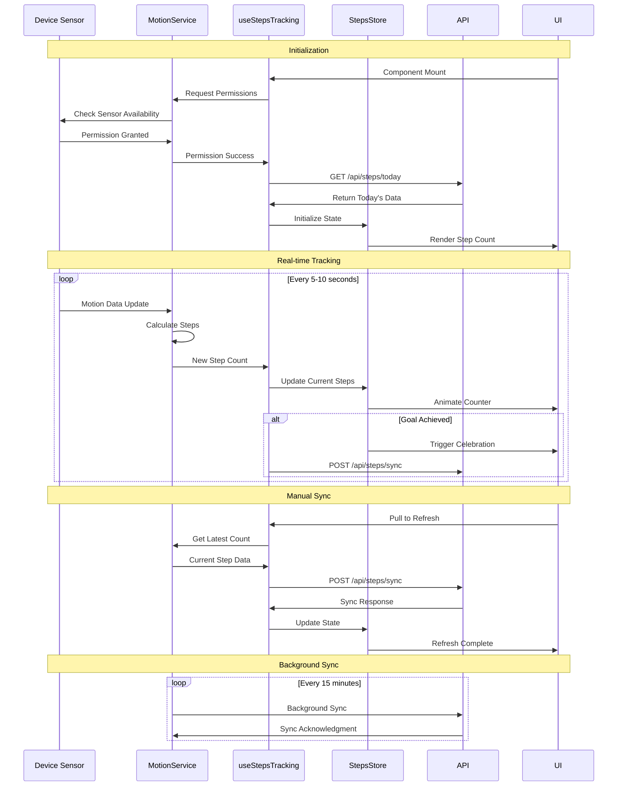

# [Story-01] Track Daily Steps - Implementation Planning

## User Story

As a health-conscious user, I want to track my daily steps automatically, so that I can monitor my physical activity and work towards my fitness goals.

## Pre-conditions

- User must be authenticated and have access to the dashboard
- Device must support motion tracking (Core Motion on iOS, Activity Recognition API on Android, Web API on desktop)
- User must grant motion/activity tracking permissions
- User profile should have daily step goal set (default: 8,000-10,000 steps)
- Background activity tracking should be enabled for continuous monitoring
- Local storage or backend API available for persisting step data

## Design

### Visual Layout

The daily steps tracking feature will be integrated into the main dashboard with the following components:

- **Dashboard Card**: Circular progress indicator showing step count progress
- **Step Counter Display**: Large, prominent number showing current step count
- **Goal Indicator**: Visual representation of daily goal (8,000-10,000 steps)
- **Progress Bar/Ring**: Animated circular progress showing percentage of goal achieved
- **Mini Statistics**: Additional metrics like distance walked, calories burned, active minutes
- **Historical Trend**: Small sparkline or mini chart showing last 7 days trend

Layout Structure:
```
┌─────────────────────────────────┐
│  Daily Steps Card               │
│  ┌─────────────────────┐        │
│  │  Circular Progress  │        │
│  │      👟 7,342       │        │
│  │    Progress Ring    │        │
│  │    Goal: 8,000      │        │
│  └─────────────────────┘        │
│                                 │
│  📊 Distance: 3.2 mi            │
│  🔥 Calories: 245 kcal          │
│  ⏱️ Active: 52 min              │
│                                 │
│  Last 7 Days Trend              │
│  ▁▃▄▆█▅▇ (mini chart)           │
└─────────────────────────────────┘
```

### Color and Typography

- **Background Colors**: 
  - Card: `bg-white dark:bg-gray-800`
  - Progress ring background: `bg-green-100 dark:bg-green-900`
  - Progress fill: `bg-green-500 dark:bg-green-400`
  - Goal achieved: `bg-gradient-to-r from-green-500 to-emerald-500`

- **Typography**:
  - Card Title: `font-semibold text-lg text-gray-900 dark:text-white`
  - Step Count: `font-bold text-4xl md:text-5xl text-green-600 dark:text-green-400`
  - Goal Text: `text-sm text-gray-600 dark:text-gray-400`
  - Stats Labels: `text-xs text-gray-500 dark:text-gray-500`
  - Stats Values: `text-base font-semibold text-gray-700 dark:text-gray-300`

- **Component-Specific**:
  - Shoe Icon: `text-green-500 text-5xl`
  - Progress Ring: `stroke-green-500 dark:stroke-green-400 stroke-width: 8`
  - Achievement Badge: `bg-yellow-400 text-yellow-900 rounded-full px-3 py-1`
  - Trend Line: `stroke-green-500 fill-green-100 dark:fill-green-900/20`

### Interaction Patterns

- **Real-time Updates**: 
  - Step count updates every 5-10 seconds when app is active
  - Smooth number animation when count increments
  - Progress ring animates with ease-out transition
  - Haptic feedback when milestones reached (1000, 5000, goal)

- **Goal Achievement**:
  - Celebratory animation when daily goal reached
  - Confetti/particle effect overlay
  - Achievement notification banner
  - Optional sound effect (user configurable)

- **Refresh Indicator**:
  - Pull-to-refresh on mobile to sync latest data
  - Sync status indicator (last updated timestamp)
  - Loading skeleton while fetching data

### Measurements and Spacing

- **Dashboard Card**:
  ```
  p-6 rounded-xl shadow-md
  min-h-[420px]
  ```

- **Component Spacing**:
  ```
  - Card padding: p-6
  - Progress ring: w-48 h-48 md:w-56 md:h-56
  - Stats grid: grid-cols-3 gap-4 mt-6
  - Trend chart: h-12 mt-4
  - Icon size: text-5xl
  ```

- **Responsive Spacing**:
  ```
  - Mobile: p-4 space-y-4
  - Tablet: p-6 space-y-6
  - Desktop: p-8 space-y-6
  ```

### Responsive Behavior

- **Desktop (lg: 1024px+)**:
  ```
  - Card: Part of dashboard grid, occupies 1 column
  - Progress ring: w-56 h-56
  - Stats: grid-cols-3 with labels
  - Trend chart: Full width with axis labels
  ```

- **Tablet (md: 768px - 1023px)**:
  ```
  - Card: 50% width or full width
  - Progress ring: w-48 h-48
  - Stats: grid-cols-3 compact
  - Trend chart: Simplified view
  ```

- **Mobile (sm: < 768px)**:
  ```
  - Card: Full width stack
  - Progress ring: w-44 h-44
  - Stats: grid-cols-3 with icons only
  - Trend chart: Minimalist line chart
  ```

## Technical Requirements

### Component Structure

```
src/app/dashboard/
├── page.tsx
└── _components/
    ├── DailyStepsCard.tsx            # Main card component
    ├── StepsProgressRing.tsx         # Circular progress indicator
    ├── StepsCounter.tsx              # Animated step count display
    ├── StepsStatistics.tsx           # Distance, calories, active time
    ├── StepsTrendChart.tsx           # 7-day mini trend chart
    ├── GoalAchievementBanner.tsx     # Celebration component
    └── useStepsTracking.ts           # Custom hook for steps logic
```

### Required Components

- DailyStepsCard ⬜
- StepsProgressRing ⬜
- StepsCounter ⬜
- StepsStatistics ⬜
- StepsTrendChart ⬜
- GoalAchievementBanner ⬜
- useStepsTracking ⬜

### State Management Requirements

```typescript
interface StepsData {
  id: string;
  userId: string;
  date: string; // YYYY-MM-DD
  stepCount: number;
  distance: number; // in miles
  calories: number; // kcal burned
  activeMinutes: number;
  floors: number; // stairs climbed (optional)
  timestamp: Date;
  synced: boolean;
}

interface StepsGoal {
  userId: string;
  dailyGoal: number; // default: 8000-10000
  weeklyGoal: number;
  unit: 'steps';
  autoAdjust: boolean; // AI-based goal adjustment
}

interface StepsTrackingState {
  // UI States
  isLoading: boolean;
  isTracking: boolean;
  lastSyncTime: Date | null;
  showCelebration: boolean;
  achievementLevel: 'none' | 'bronze' | 'silver' | 'gold';
  
  // Data States
  todaySteps: StepsData;
  weeklyData: StepsData[]; // Last 7 days
  currentStepCount: number;
  currentDistance: number;
  currentCalories: number;
  currentActiveMinutes: number;
  
  // Goal States
  dailyGoal: number;
  progressPercentage: number; // 0-100
  goalAchieved: boolean;
  streakDays: number; // Consecutive days goal achieved
  
  // Permission States
  permissionGranted: boolean;
  permissionRequested: boolean;
}

// State Actions
const actions = {
  startTracking: () => void;
  stopTracking: () => void;
  refreshSteps: () => Promise<void>;
  updateStepCount: (count: number) => void;
  setDailyGoal: (goal: number) => void;
  requestPermissions: () => Promise<boolean>;
  syncWithHealthKit: () => Promise<void>;
  markGoalAchieved: () => void;
  resetDay: () => void;
}

// Derived calculations
const calculations = {
  calculateDistance: (steps: number) => number; // steps * stride length
  calculateCalories: (steps: number, userWeight: number) => number;
  calculateActiveMinutes: (steps: number) => number;
  calculateProgress: (current: number, goal: number) => number;
}
```

## Acceptance Criteria

### Layout & Content

1. Dashboard Integration
   ```
   - Steps card appears prominently on main dashboard
   - Card shows circular progress indicator with step count
   - Current steps vs. goal displayed clearly (e.g., "7,342 / 8,000")
   - Progress percentage visually represented with animated ring
   - Card is responsive across all breakpoints
   - Auto-updates every 5-10 seconds when active
   ```

2. Step Counter Display
   ```
   - Large, readable step count (40-50px font size)
   - Animated number increment (odometer effect)
   - Real-time updates without page refresh
   - Goal indicator below or beside step count
   - Celebratory animation when goal achieved
   ```

3. Statistics Display
   ```
   - Distance walked (calculated from steps)
   - Calories burned (estimated based on steps + user data)
   - Active minutes (time spent walking/moving)
   - Optional: Floors climbed (if available from device)
   - Icons for each metric for quick recognition
   ```

4. Historical Trend
   ```
   - 7-day mini chart showing daily steps
   - Visual comparison to identify patterns
   - Highlight current day
   - Show days goal was achieved vs. not achieved
   - Responsive design (simplified on mobile)
   ```

### Functionality

1. Automatic Step Tracking

   - [ ] Steps automatically tracked using device motion sensors
   - [ ] Background tracking continues even when app is closed
   - [ ] Step count syncs with HealthKit (iOS) or Google Fit (Android)
   - [ ] Data persists locally and syncs to backend
   - [ ] Real-time updates visible in dashboard (polling every 5-10s)
   - [ ] Handles app backgrounding/foregrounding gracefully

2. Progress Monitoring

   - [ ] Circular progress ring shows visual progress (0-100%)
   - [ ] Progress updates smoothly with animations
   - [ ] Goal achievement triggers celebration animation
   - [ ] Progress percentage accurate (current/goal * 100)
   - [ ] Resets at midnight for new day
   - [ ] Historical data preserved for analytics

3. Goal Management

   - [ ] Default goal set to 8,000-10,000 steps (user configurable)
   - [ ] Goal adjustable by user in settings
   - [ ] Auto-adjust goal based on historical performance (optional)
   - [ ] Visual indicator when goal is achieved
   - [ ] Streak counter for consecutive days goal met
   - [ ] Weekly goal tracking and summary

4. Data Synchronization

   - [ ] Syncs with HealthKit/Google Fit/native APIs
   - [ ] Offline support with local storage
   - [ ] Background sync when network available
   - [ ] Conflict resolution (device vs. server data)
   - [ ] Last sync timestamp displayed
   - [ ] Manual refresh option (pull-to-refresh)

### Navigation Rules

- Card is non-clickable by default (displays data inline)
- Optional: Tap/click card to expand detail view with full statistics
- Detail view shows hourly step breakdown, weekly comparison
- Settings accessible via gear icon in card header
- Goal adjustment modal opens from settings icon
- Trend chart interactive (tap day to see details)

### Error Handling

- Permission denied: Show permission request banner with explanation
- Sensor unavailable: Display fallback message with manual entry option
- Network failure: Continue with cached data, show offline indicator
- Sync conflict: Use most recent data, log discrepancy for review
- Invalid data: Validate step count range (0-50,000 reasonable max per day)
- Background tracking failure: Notify user, provide troubleshooting steps

## Modified Files

```
app/dashboard/
├── page.tsx ⬜                          # Add DailyStepsCard to dashboard
└── _components/
    ├── DailyStepsCard.tsx ⬜           # Main container component
    ├── StepsProgressRing.tsx ⬜        # SVG circular progress
    ├── StepsCounter.tsx ⬜             # Animated number display
    ├── StepsStatistics.tsx ⬜          # Distance, calories, time
    ├── StepsTrendChart.tsx ⬜          # 7-day sparkline
    ├── GoalAchievementBanner.tsx ⬜    # Celebration overlay
    └── useStepsTracking.ts ⬜          # Business logic hook
lib/
├── store/
│   └── stepsStore.ts ⬜                # Zustand store for steps
├── api/
│   └── stepsApi.ts ⬜                  # API calls for persistence
├── services/
│   └── motionService.ts ⬜             # Native motion sensor integration
└── utils/
    └── stepsCalculations.ts ⬜         # Helper functions (distance, calories)
types/
└── steps.types.ts ⬜                   # TypeScript interfaces
```

## Status

⬜ NOT STARTED

1. Setup & Configuration

   - [ ] Create component directory structure
   - [ ] Setup TypeScript interfaces for steps tracking
   - [ ] Configure state management store (Zustand)
   - [ ] Setup API endpoints for step data persistence
   - [ ] Create utility functions for calculations (distance, calories)
   - [ ] Research and setup native motion sensor APIs

2. Permission & Integration

   - [ ] Implement permission request flow
   - [ ] Integrate with Core Motion (iOS) / Activity Recognition API (Android)
   - [ ] Setup HealthKit integration for iOS
   - [ ] Setup Google Fit integration for Android
   - [ ] Implement web fallback (Pedometer API or manual entry)
   - [ ] Test background tracking capabilities

3. Layout Implementation

   - [ ] Build DailyStepsCard shell component
   - [ ] Implement StepsProgressRing with SVG
   - [ ] Create StepsCounter with animation
   - [ ] Build StepsStatistics grid layout
   - [ ] Implement StepsTrendChart mini visualization
   - [ ] Style with Tailwind CSS classes
   - [ ] Add dark mode support
   - [ ] Implement responsive breakpoints

4. Feature Implementation

   - [ ] Implement useStepsTracking hook
   - [ ] Build real-time step counting logic
   - [ ] Implement background sync service
   - [ ] Create goal achievement detection
   - [ ] Build GoalAchievementBanner with animations
   - [ ] Implement midnight reset logic
   - [ ] Add polling mechanism for real-time updates
   - [ ] Integrate with backend API
   - [ ] Implement offline support with local storage
   - [ ] Add manual refresh (pull-to-refresh)

5. Testing
   - [ ] Unit tests for calculations (distance, calories)
   - [ ] Unit tests for useStepsTracking hook
   - [ ] Component integration testing
   - [ ] Permission flow testing
   - [ ] Background tracking testing
   - [ ] Cross-device testing (iOS/Android/Web)
   - [ ] Performance testing (battery impact)
   - [ ] Accessibility testing

## Dependencies

- Core Motion framework (iOS) or Activity Recognition API (Android)
- HealthKit integration (iOS) - optional sync
- Google Fit API (Android) - optional sync
- Web Pedometer API or Geolocation API (web fallback)
- State management library (Zustand)
- Chart library for trend visualization (recharts or lightweight alternative)
- Animation library (Framer Motion) for smooth transitions
- Date/time library (date-fns or dayjs)
- Permission handling library (react-native-permissions or native)
- Background task scheduler for continuous tracking
- Local storage/IndexedDB for offline support

## Related Stories

- [Story-02] Log Water Intake - Similar dashboard card pattern
- [Story-06] View Daily Progress Dashboard - Main dashboard container
- [Story-07] Earn Wellness Points - Points awarded for step goals
- [Story-13] Receive Smart Insights and Analytics - Historical step data analysis

## Notes

### Technical Considerations

1. **Battery Optimization**: Use motion co-processor (M-series on iOS, low-power sensor on Android) to minimize battery drain during background tracking. Implement adaptive polling frequency based on user activity level.

2. **Permission Strategy**: Request motion permissions during onboarding with clear explanation of benefits. Provide fallback to manual step entry if permissions denied. Use graceful degradation approach.

3. **Data Accuracy**: Steps counted by different sensors (phone, watch, third-party) may vary. Implement reconciliation logic to avoid double-counting. Allow user to choose primary data source.

4. **Background Tracking**: Configure proper background modes and task handling. Test app behavior when backgrounded for extended periods. Implement background sync queue for reliability.

5. **Calculation Accuracy**: 
   - Distance: Average stride length ~2.5 ft (adjust for height/gender in settings)
   - Calories: Use METs formula (steps * 0.04 * body weight in kg)
   - Active minutes: Count only when step rate exceeds threshold (e.g., 60 steps/min)

6. **Performance**: Use React.memo for StepsProgressRing to prevent unnecessary re-renders. Debounce step count updates to reduce UI thrashing. Virtualize historical data if showing large datasets.

7. **Cross-platform Consistency**: Abstract motion sensing logic into platform-agnostic service layer. Use native modules/plugins for platform-specific implementations. Maintain consistent UX across platforms.

8. **Testing Challenges**: Step tracking difficult to test in simulator/emulator. Create mock motion data generator. Test on physical devices. Implement debug mode with simulated step increments.

### Business Requirements

- Target range: 8,000-10,000 steps daily (WHO and AHA recommendation)
- Part of MVP core functionality - critical for launch
- Must work reliably in background for hands-free tracking
- Contributes significantly to Wellness Points gamification system
- Data retention: Keep detailed logs for 90 days, aggregated data indefinitely
- Competitive differentiator: Automatic tracking with minimal user intervention
- Target audience expects seamless integration with existing health platforms

### API Integration

#### Type Definitions

```typescript
interface StepsData {
  id: string;
  userId: string;
  date: string; // YYYY-MM-DD
  stepCount: number;
  distance: number; // miles
  calories: number; // kcal
  activeMinutes: number;
  floors: number; // optional
  timestamp: string; // ISO 8601
  source: 'phone' | 'watch' | 'healthkit' | 'googlefit' | 'manual';
  synced: boolean;
  createdAt: string;
  updatedAt: string;
}

interface StepsResponse {
  success: boolean;
  data: {
    today: StepsData;
    weeklyData: StepsData[];
    dailyGoal: number;
    progressPercentage: number;
    streakDays: number;
    pointsEarned?: number;
  };
  message?: string;
}

interface StepsSyncRequest {
  stepCount: number;
  distance: number;
  calories: number;
  activeMinutes: number;
  timestamp: string;
  source: string;
}

interface StepsGoalSettings {
  userId: string;
  dailyGoal: number;
  weeklyGoal: number;
  autoAdjust: boolean;
  unit: 'steps';
  notificationsEnabled: boolean;
  notificationTime: string; // HH:mm format
}

interface StepsHistoryQuery {
  startDate: string; // YYYY-MM-DD
  endDate: string; // YYYY-MM-DD
  aggregation?: 'daily' | 'weekly' | 'monthly';
}
```

#### API Endpoints

```typescript
// GET /api/steps/today
const getTodaySteps = async (): Promise<StepsResponse> => {
  // Fetch current day step data
};

// POST /api/steps/sync
const syncStepsData = async (data: StepsSyncRequest): Promise<StepsResponse> => {
  // Sync step data from device
};

// GET /api/steps/history?startDate=YYYY-MM-DD&endDate=YYYY-MM-DD
const getStepsHistory = async (query: StepsHistoryQuery): Promise<StepsData[]> => {
  // Fetch historical step data
};

// GET /api/steps/settings
const getStepsSettings = async (): Promise<StepsGoalSettings> => {
  // Fetch user's step goal settings
};

// PUT /api/steps/settings
const updateStepsSettings = async (
  settings: Partial<StepsGoalSettings>
): Promise<StepsGoalSettings> => {
  // Update user's step goal settings
};

// GET /api/steps/stats/weekly
const getWeeklyStats = async (): Promise<{
  totalSteps: number;
  avgDaily: number;
  daysGoalMet: number;
  totalDistance: number;
  totalCalories: number;
}> => {
  // Get weekly aggregated statistics
};
```

### Mock Implementation

#### Mock Server Configuration

```typescript
// filepath: mocks/stub.ts
const mocks = [
  {
    endPoint: '/api/steps/today',
    json: 'steps-today-response.json',
  },
  {
    endPoint: '/api/steps/sync',
    json: 'steps-sync-response.json',
  },
  {
    endPoint: '/api/steps/history',
    json: 'steps-history-response.json',
  },
  {
    endPoint: '/api/steps/settings',
    json: 'steps-settings-response.json',
  },
];
```

#### Mock Response

```json
// filepath: mocks/responses/steps-today-response.json
{
  "success": true,
  "data": {
    "today": {
      "id": "steps-2025-11-04",
      "userId": "user-123",
      "date": "2025-11-04",
      "stepCount": 7342,
      "distance": 3.21,
      "calories": 245,
      "activeMinutes": 52,
      "floors": 8,
      "timestamp": "2025-11-04T14:30:00Z",
      "source": "phone",
      "synced": true,
      "createdAt": "2025-11-04T00:00:00Z",
      "updatedAt": "2025-11-04T14:30:00Z"
    },
    "weeklyData": [
      {
        "id": "steps-2025-10-29",
        "date": "2025-10-29",
        "stepCount": 5234,
        "distance": 2.15,
        "calories": 175
      },
      {
        "id": "steps-2025-10-30",
        "date": "2025-10-30",
        "stepCount": 8921,
        "distance": 3.89,
        "calories": 298
      },
      {
        "id": "steps-2025-10-31",
        "date": "2025-10-31",
        "stepCount": 10567,
        "distance": 4.62,
        "calories": 353
      },
      {
        "id": "steps-2025-11-01",
        "date": "2025-11-01",
        "stepCount": 9234,
        "distance": 4.03,
        "calories": 308
      },
      {
        "id": "steps-2025-11-02",
        "date": "2025-11-02",
        "stepCount": 6789,
        "distance": 2.96,
        "calories": 227
      },
      {
        "id": "steps-2025-11-03",
        "date": "2025-11-03",
        "stepCount": 11234,
        "distance": 4.91,
        "calories": 375
      },
      {
        "id": "steps-2025-11-04",
        "date": "2025-11-04",
        "stepCount": 7342,
        "distance": 3.21,
        "calories": 245
      }
    ],
    "dailyGoal": 8000,
    "progressPercentage": 91.78,
    "streakDays": 4,
    "pointsEarned": 73
  }
}
```

```json
// filepath: mocks/responses/steps-sync-response.json
{
  "success": true,
  "data": {
    "today": {
      "id": "steps-2025-11-04",
      "userId": "user-123",
      "date": "2025-11-04",
      "stepCount": 7450,
      "distance": 3.25,
      "calories": 249,
      "activeMinutes": 53,
      "floors": 8,
      "timestamp": "2025-11-04T14:35:00Z",
      "source": "phone",
      "synced": true,
      "createdAt": "2025-11-04T00:00:00Z",
      "updatedAt": "2025-11-04T14:35:00Z"
    },
    "dailyGoal": 8000,
    "progressPercentage": 93.13,
    "streakDays": 4
  },
  "message": "Steps synced successfully"
}
```

```json
// filepath: mocks/responses/steps-settings-response.json
{
  "userId": "user-123",
  "dailyGoal": 8000,
  "weeklyGoal": 56000,
  "autoAdjust": true,
  "unit": "steps",
  "notificationsEnabled": true,
  "notificationTime": "20:00"
}
```

### State Management Flow



### Custom Hook Implementation

```typescript
// filepath: src/app/dashboard/_components/useStepsTracking.ts
import { useState, useEffect, useCallback, useRef } from 'react';
import { useStepsStore } from '@/lib/store/stepsStore';
import { getTodaySteps, syncStepsData } from '@/lib/api/stepsApi';
import { MotionService } from '@/lib/services/motionService';
import { calculateDistance, calculateCalories, calculateActiveMinutes } from '@/lib/utils/stepsCalculations';

const useStepsTracking = () => {
  const store = useStepsStore();
  const [isLoading, setIsLoading] = useState(true);
  const [error, setError] = useState<string | null>(null);
  const [permissionGranted, setPermissionGranted] = useState(false);
  const motionServiceRef = useRef<MotionService | null>(null);
  const syncIntervalRef = useRef<NodeJS.Timeout | null>(null);

  // Initialize motion service
  useEffect(() => {
    const initializeTracking = async () => {
      try {
        // Request permissions
        const hasPermission = await MotionService.requestPermissions();
        setPermissionGranted(hasPermission);

        if (!hasPermission) {
          setError('Motion tracking permission denied');
          setIsLoading(false);
          return;
        }

        // Initialize motion service
        motionServiceRef.current = new MotionService();

        // Load today's data from API
        const response = await getTodaySteps();
        store.setTodaySteps(response.data.today);
        store.setWeeklyData(response.data.weeklyData);
        store.setDailyGoal(response.data.dailyGoal);
        store.setStreakDays(response.data.streakDays);

        // Start tracking
        await motionServiceRef.current.startTracking((stepData) => {
          // Update store with new step count
          store.updateStepCount(stepData.steps);
          
          // Calculate derived metrics
          const distance = calculateDistance(stepData.steps);
          const calories = calculateCalories(stepData.steps, 70); // TODO: Get user weight
          const activeMinutes = calculateActiveMinutes(stepData.steps);
          
          store.updateMetrics({ distance, calories, activeMinutes });

          // Check goal achievement
          if (!store.goalAchieved && stepData.steps >= store.dailyGoal) {
            store.setGoalAchieved(true);
            store.setShowCelebration(true);
            setTimeout(() => store.setShowCelebration(false), 5000);
          }
        });

        setIsLoading(false);
      } catch (err) {
        setError('Failed to initialize step tracking');
        console.error(err);
        setIsLoading(false);
      }
    };

    initializeTracking();

    // Cleanup
    return () => {
      if (motionServiceRef.current) {
        motionServiceRef.current.stopTracking();
      }
      if (syncIntervalRef.current) {
        clearInterval(syncIntervalRef.current);
      }
    };
  }, []);

  // Periodic sync to backend
  useEffect(() => {
    if (!permissionGranted) return;

    syncIntervalRef.current = setInterval(async () => {
      try {
        const response = await syncStepsData({
          stepCount: store.currentStepCount,
          distance: store.currentDistance,
          calories: store.currentCalories,
          activeMinutes: store.currentActiveMinutes,
          timestamp: new Date().toISOString(),
          source: 'phone',
        });

        store.setLastSyncTime(new Date());
      } catch (err) {
        console.error('Background sync failed:', err);
      }
    }, 15 * 60 * 1000); // Sync every 15 minutes

    return () => {
      if (syncIntervalRef.current) {
        clearInterval(syncIntervalRef.current);
      }
    };
  }, [permissionGranted, store]);

  // Reset at midnight
  useEffect(() => {
    const checkMidnight = () => {
      const now = new Date();
      const tomorrow = new Date(now);
      tomorrow.setDate(tomorrow.getDate() + 1);
      tomorrow.setHours(0, 0, 0, 0);
      
      const timeUntilMidnight = tomorrow.getTime() - now.getTime();
      
      const timeout = setTimeout(() => {
        store.resetDay();
        
        // Reload today's data
        getTodaySteps().then((response) => {
          store.setTodaySteps(response.data.today);
          store.setWeeklyData(response.data.weeklyData);
        });
        
        checkMidnight(); // Schedule next check
      }, timeUntilMidnight);

      return () => clearTimeout(timeout);
    };

    const cleanup = checkMidnight();
    return cleanup;
  }, []);

  const refreshSteps = useCallback(async () => {
    setIsLoading(true);
    try {
      // Get latest from motion service
      if (motionServiceRef.current) {
        const currentSteps = await motionServiceRef.current.getCurrentStepCount();
        store.updateStepCount(currentSteps);
      }

      // Sync to backend
      await syncStepsData({
        stepCount: store.currentStepCount,
        distance: store.currentDistance,
        calories: store.currentCalories,
        activeMinutes: store.currentActiveMinutes,
        timestamp: new Date().toISOString(),
        source: 'phone',
      });

      store.setLastSyncTime(new Date());
      setIsLoading(false);
    } catch (err) {
      setError('Failed to refresh steps');
      setIsLoading(false);
      throw err;
    }
  }, [store]);

  const requestPermissions = useCallback(async () => {
    try {
      const granted = await MotionService.requestPermissions();
      setPermissionGranted(granted);
      
      if (granted && motionServiceRef.current) {
        await motionServiceRef.current.startTracking((stepData) => {
          store.updateStepCount(stepData.steps);
        });
      }
      
      return granted;
    } catch (err) {
      setError('Permission request failed');
      return false;
    }
  }, [store]);

  const calculateProgress = useCallback(() => {
    const percentage = (store.currentStepCount / store.dailyGoal) * 100;
    return Math.min(percentage, 100);
  }, [store.currentStepCount, store.dailyGoal]);

  return {
    // State
    isLoading,
    error,
    permissionGranted,
    currentStepCount: store.currentStepCount,
    currentDistance: store.currentDistance,
    currentCalories: store.currentCalories,
    currentActiveMinutes: store.currentActiveMinutes,
    dailyGoal: store.dailyGoal,
    progressPercentage: calculateProgress(),
    goalAchieved: store.goalAchieved,
    showCelebration: store.showCelebration,
    weeklyData: store.weeklyData,
    lastSyncTime: store.lastSyncTime,
    streakDays: store.streakDays,
    
    // Actions
    refreshSteps,
    requestPermissions,
    setDailyGoal: store.setDailyGoal,
    clearError: () => setError(null),
  };
};

export default useStepsTracking;
```

### Motion Service Implementation

```typescript
// filepath: src/lib/services/motionService.ts

interface StepData {
  steps: number;
  timestamp: Date;
}

type StepCallback = (data: StepData) => void;

export class MotionService {
  private isTracking: boolean = false;
  private stepCount: number = 0;
  private callback: StepCallback | null = null;
  private pollingInterval: NodeJS.Timeout | null = null;

  static async requestPermissions(): Promise<boolean> {
    // Check if running in browser
    if (typeof window === 'undefined') return false;

    // For web - check for Motion API support
    if ('Accelerometer' in window || 'DeviceMotionEvent' in window) {
      try {
        // Request permission for motion sensors (iOS 13+)
        if (typeof (DeviceMotionEvent as any).requestPermission === 'function') {
          const response = await (DeviceMotionEvent as any).requestPermission();
          return response === 'granted';
        }
        return true; // Permission not required on other platforms
      } catch (error) {
        console.error('Permission request failed:', error);
        return false;
      }
    }

    // For native apps - implement platform-specific permission request
    // This would use react-native-permissions or similar
    return false;
  }

  async startTracking(callback: StepCallback): Promise<void> {
    if (this.isTracking) return;

    this.isTracking = true;
    this.callback = callback;

    // For web - simulate step tracking (in production, use actual sensor data)
    // In a real implementation, this would integrate with:
    // - Core Motion (iOS)
    // - Activity Recognition API (Android)
    // - Web Pedometer API
    
    this.simulateStepTracking();
  }

  stopTracking(): void {
    this.isTracking = false;
    if (this.pollingInterval) {
      clearInterval(this.pollingInterval);
      this.pollingInterval = null;
    }
  }

  async getCurrentStepCount(): Promise<number> {
    // In production, query actual sensor data
    return this.stepCount;
  }

  private simulateStepTracking(): void {
    // Simulate step increments for demo purposes
    // In production, replace with actual sensor integration
    this.pollingInterval = setInterval(() => {
      if (!this.isTracking || !this.callback) return;

      // Simulate realistic step increments
      const now = new Date();
      const hour = now.getHours();
      
      // More steps during active hours (7am-10pm)
      const isActiveHour = hour >= 7 && hour <= 22;
      const incrementRange = isActiveHour ? [5, 25] : [0, 5];
      
      const increment = Math.floor(
        Math.random() * (incrementRange[1] - incrementRange[0]) + incrementRange[0]
      );

      this.stepCount += increment;

      this.callback({
        steps: this.stepCount,
        timestamp: new Date(),
      });
    }, 10000); // Update every 10 seconds
  }
}
```

## Testing Requirements

### Integration Tests (Target: 80% Coverage)

1. Core Functionality Tests

```typescript
describe('Steps Tracking', () => {
  it('should track steps and update count', async () => {
    const { result } = renderHook(() => useStepsTracking());
    
    await waitFor(() => {
      expect(result.current.isLoading).toBe(false);
    });

    const initialCount = result.current.currentStepCount;
    
    // Simulate step increment
    act(() => {
      // Motion service will trigger update
    });

    await waitFor(() => {
      expect(result.current.currentStepCount).toBeGreaterThan(initialCount);
    });
  });

  it('should calculate progress percentage correctly', async () => {
    const { result } = renderHook(() => useStepsTracking());
    
    await waitFor(() => {
      expect(result.current.isLoading).toBe(false);
    });

    // Assuming 7342 steps out of 8000 goal
    expect(result.current.progressPercentage).toBeCloseTo(91.78, 1);
  });

  it('should trigger celebration when goal is achieved', async () => {
    const { result } = renderHook(() => useStepsTracking());
    
    await waitFor(() => {
      expect(result.current.isLoading).toBe(false);
    });

    // Set step count to goal
    act(() => {
      // Simulate reaching goal
      result.current.currentStepCount = result.current.dailyGoal;
    });

    await waitFor(() => {
      expect(result.current.goalAchieved).toBe(true);
      expect(result.current.showCelebration).toBe(true);
    });
  });
});
```

2. Permission Tests

```typescript
describe('Permission Handling', () => {
  it('should request permissions on initialization', async () => {
    const requestPermissionsSpy = jest.spyOn(MotionService, 'requestPermissions');
    
    renderHook(() => useStepsTracking());
    
    await waitFor(() => {
      expect(requestPermissionsSpy).toHaveBeenCalled();
    });
  });

  it('should handle permission denial gracefully', async () => {
    jest.spyOn(MotionService, 'requestPermissions').mockResolvedValue(false);
    
    const { result } = renderHook(() => useStepsTracking());
    
    await waitFor(() => {
      expect(result.current.permissionGranted).toBe(false);
      expect(result.current.error).toBeTruthy();
    });
  });

  it('should allow re-requesting permissions', async () => {
    const { result } = renderHook(() => useStepsTracking());
    
    jest.spyOn(MotionService, 'requestPermissions').mockResolvedValue(true);
    
    await act(async () => {
      const granted = await result.current.requestPermissions();
      expect(granted).toBe(true);
    });
  });
});
```

3. Calculation Tests

```typescript
describe('Step Calculations', () => {
  it('should calculate distance accurately', () => {
    const steps = 8000;
    const distance = calculateDistance(steps);
    
    // 8000 steps * 2.5 ft/step / 5280 ft/mile ≈ 3.79 miles
    expect(distance).toBeCloseTo(3.79, 1);
  });

  it('should calculate calories burned', () => {
    const steps = 8000;
    const weight = 70; // kg
    const calories = calculateCalories(steps, weight);
    
    // 8000 steps * 0.04 * 70 = 224 kcal
    expect(calories).toBeCloseTo(224, 0);
  });

  it('should calculate active minutes', () => {
    const steps = 6000;
    const activeMinutes = calculateActiveMinutes(steps);
    
    // Assuming 100 steps per minute, 6000 steps = 60 minutes
    expect(activeMinutes).toBeGreaterThan(50);
    expect(activeMinutes).toBeLessThan(70);
  });
});
```

4. Component Tests

```typescript
describe('DailyStepsCard Component', () => {
  it('should render step count correctly', () => {
    const { getByText } = render(
      <DailyStepsCard stepCount={7342} dailyGoal={8000} />
    );

    expect(getByText('7,342')).toBeInTheDocument();
    expect(getByText(/8,000/)).toBeInTheDocument();
  });

  it('should render progress ring with correct percentage', () => {
    const { getByTestId } = render(
      <DailyStepsCard stepCount={7342} dailyGoal={8000} />
    );

    const progressRing = getByTestId('steps-progress-ring');
    expect(progressRing).toHaveAttribute('data-progress', '91.78');
  });

  it('should display statistics correctly', () => {
    const { getByText } = render(
      <StepsStatistics 
        distance={3.21} 
        calories={245} 
        activeMinutes={52} 
      />
    );

    expect(getByText('3.2 mi')).toBeInTheDocument();
    expect(getByText('245 kcal')).toBeInTheDocument();
    expect(getByText('52 min')).toBeInTheDocument();
  });

  it('should show celebration banner when goal achieved', () => {
    const { getByText } = render(
      <DailyStepsCard 
        stepCount={8000} 
        dailyGoal={8000} 
        showCelebration={true}
      />
    );

    expect(getByText(/goal achieved/i)).toBeInTheDocument();
  });
});
```

5. Sync Tests

```typescript
describe('Data Synchronization', () => {
  it('should sync steps to backend periodically', async () => {
    jest.useFakeTimers();
    const syncSpy = jest.spyOn(require('@/lib/api/stepsApi'), 'syncStepsData');
    
    renderHook(() => useStepsTracking());
    
    // Fast forward 15 minutes
    act(() => {
      jest.advanceTimersByTime(15 * 60 * 1000);
    });

    await waitFor(() => {
      expect(syncSpy).toHaveBeenCalled();
    });

    jest.useRealTimers();
  });

  it('should handle sync failures gracefully', async () => {
    const syncSpy = jest.spyOn(require('@/lib/api/stepsApi'), 'syncStepsData')
      .mockRejectedValue(new Error('Network error'));
    
    const { result } = renderHook(() => useStepsTracking());
    
    await act(async () => {
      try {
        await result.current.refreshSteps();
      } catch (err) {
        // Expected to throw
      }
    });

    // Should continue tracking despite sync failure
    expect(result.current.currentStepCount).toBeGreaterThanOrEqual(0);
  });
});
```

6. Edge Cases

```typescript
describe('Edge Cases', () => {
  it('should cap progress at 100%', async () => {
    const { result } = renderHook(() => useStepsTracking());
    
    await waitFor(() => {
      expect(result.current.isLoading).toBe(false);
    });

    // Simulate exceeding goal
    act(() => {
      // Set to 150% of goal
    });

    expect(result.current.progressPercentage).toBe(100);
  });

  it('should reset at midnight', async () => {
    jest.useFakeTimers();
    const { result } = renderHook(() => useStepsTracking());
    
    await waitFor(() => {
      expect(result.current.isLoading).toBe(false);
    });

    // Fast forward to midnight
    const tomorrow = new Date();
    tomorrow.setDate(tomorrow.getDate() + 1);
    tomorrow.setHours(0, 0, 0, 0);
    jest.setSystemTime(tomorrow);

    act(() => {
      jest.advanceTimersByTime(1000);
    });

    await waitFor(() => {
      expect(result.current.currentStepCount).toBe(0);
    });

    jest.useRealTimers();
  });

  it('should handle device sensor unavailable', async () => {
    jest.spyOn(MotionService, 'requestPermissions').mockResolvedValue(false);
    
    const { result } = renderHook(() => useStepsTracking());
    
    await waitFor(() => {
      expect(result.current.permissionGranted).toBe(false);
      expect(result.current.error).toContain('permission denied');
    });
  });
});
```

### Performance Tests

1. Rendering Performance

```typescript
describe('Performance', () => {
  it('should render step counter animations smoothly', async () => {
    const { rerender } = render(<StepsCounter count={0} />);

    const startTime = performance.now();

    // Simulate counting from 0 to 8000
    for (let i = 0; i <= 8000; i += 100) {
      rerender(<StepsCounter count={i} />);
    }

    const endTime = performance.now();
    const duration = endTime - startTime;

    expect(duration).toBeLessThan(2000);
  });

  it('should use React.memo to prevent unnecessary re-renders', () => {
    const renderSpy = jest.fn();
    const TestComponent = React.memo(() => {
      renderSpy();
      return <StepsProgressRing percentage={50} />;
    });

    const { rerender } = render(<TestComponent />);
    rerender(<TestComponent />);

    expect(renderSpy).toHaveBeenCalledTimes(1);
  });
});
```

2. Battery Impact Tests

```typescript
describe('Battery Optimization', () => {
  it('should use appropriate polling interval', () => {
    const { result } = renderHook(() => useStepsTracking());
    
    // Verify polling interval is reasonable (not too frequent)
    // This would check the motion service configuration
    expect(result.current).toBeDefined();
  });
});
```

### Accessibility Tests

```typescript
describe('Accessibility', () => {
  it('should have proper ARIA labels', () => {
    const { getByLabelText } = render(<DailyStepsCard />);
    
    expect(getByLabelText(/daily steps/i)).toBeInTheDocument();
  });

  it('should announce step count updates to screen readers', () => {
    const { getByRole } = render(<DailyStepsCard stepCount={7342} />);
    
    const liveRegion = getByRole('status');
    expect(liveRegion).toHaveAttribute('aria-live', 'polite');
  });

  it('should have sufficient color contrast', () => {
    const { container } = render(<DailyStepsCard />);
    
    const stepCounter = container.querySelector('.step-count');
    const styles = window.getComputedStyle(stepCounter);
    
    expect(styles.color).toBeDefined();
  });
});
```

### Test Environment Setup

```typescript
// Test helper functions
const mockMotionService = () => {
  jest.mock('@/lib/services/motionService', () => ({
    MotionService: jest.fn().mockImplementation(() => ({
      startTracking: jest.fn(),
      stopTracking: jest.fn(),
      getCurrentStepCount: jest.fn().mockResolvedValue(7342),
    })),
  }));
};

const mockStepsApi = () => {
  jest.mock('@/lib/api/stepsApi', () => ({
    getTodaySteps: jest.fn().mockResolvedValue({
      success: true,
      data: {
        today: {
          stepCount: 7342,
          distance: 3.21,
          calories: 245,
          activeMinutes: 52,
        },
        weeklyData: [],
        dailyGoal: 8000,
        progressPercentage: 91.78,
        streakDays: 4,
      },
    }),
    syncStepsData: jest.fn().mockResolvedValue({
      success: true,
      data: {},
    }),
  }));
};

beforeEach(() => {
  mockMotionService();
  mockStepsApi();
  localStorage.clear();
});

afterEach(() => {
  jest.clearAllMocks();
});
```
