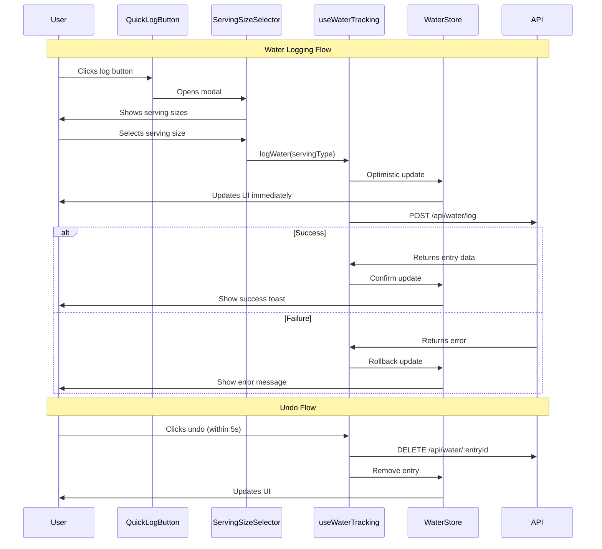

# [Story-02] Log Water Intake - Implementation Planning

## User Story

As a health-conscious user, I want to easily log my water intake throughout the day, so that I can stay properly hydrated and meet my daily hydration goals.

## Pre-conditions

- User must be authenticated and have access to the dashboard
- HealthKit permissions should be requested (optional for water logging)
- User profile should have daily water intake goal set (default: 8 glasses/64 oz)
- Local storage or backend API available for persisting water intake data

## Design

### Visual Layout

The water intake feature will be integrated into the main dashboard with the following components:

- **Dashboard Card**: Circular progress indicator showing water intake progress
- **Quick Log Button**: Prominent "+" or water drop icon for quick logging
- **Intake History**: List of today's logged water entries with timestamps
- **Serving Size Selector**: Bottom sheet/modal with predefined serving sizes
- **Daily Goal Display**: Visual representation of 8 glasses target

Layout Structure:
```
┌─────────────────────────────────┐
│  Water Intake Card              │
│  ┌─────────────────────┐        │
│  │  Circular Progress  │        │
│  │      💧 6/8         │        │
│  │    Progress Ring    │        │
│  └─────────────────────┘        │
│                                 │
│  Today's Intake:                │
│  • 8oz Glass    - 8:30 AM      │
│  • 16oz Bottle  - 10:15 AM     │
│  • 8oz Glass    - 12:00 PM     │
│                                 │
│  [+ Log Water]                  │
└─────────────────────────────────┘
```

### Color and Typography

- **Background Colors**: 
  - Card: `bg-white dark:bg-gray-800`
  - Progress ring background: `bg-blue-100 dark:bg-blue-900`
  - Progress fill: `bg-blue-500 dark:bg-blue-400`
  - Button: `bg-blue-600 hover:bg-blue-700`

- **Typography**:
  - Card Title: `font-semibold text-lg text-gray-900 dark:text-white`
  - Progress Number: `font-bold text-3xl text-blue-600 dark:text-blue-400`
  - Goal Text: `text-sm text-gray-600 dark:text-gray-400`
  - History Items: `text-base text-gray-700 dark:text-gray-300`
  - Timestamps: `text-xs text-gray-500 dark:text-gray-500`

- **Component-Specific**:
  - Water Drop Icon: `text-blue-500 text-4xl`
  - Log Button: `bg-blue-600 text-white rounded-full shadow-lg hover:shadow-xl transition-all`
  - Serving Size Options: `bg-gray-50 dark:bg-gray-700 hover:bg-blue-50 dark:hover:bg-blue-900 border-2 border-transparent hover:border-blue-500`

### Interaction Patterns

- **Quick Log Button**: 
  - Hover: Scale up to 105%, shadow increase
  - Click: Opens serving size selector modal
  - Haptic feedback on tap (mobile)
  - Accessibility: aria-label="Log water intake"

- **Serving Size Selection**:
  - Tap/Click: Immediate logging with animation
  - Visual feedback: Check mark animation on selection
  - Auto-dismiss modal after selection
  - Undo option appears briefly after logging

- **Progress Ring Animation**:
  - Smooth transition when value changes (300ms ease-out)
  - Celebratory animation when reaching daily goal
  - Pulse effect on water drop icon when close to goal

### Measurements and Spacing

- **Dashboard Card**:
  ```
  p-6 rounded-xl shadow-md
  min-h-[320px]
  ```

- **Component Spacing**:
  ```
  - Card padding: p-6
  - Progress ring: w-40 h-40 md:w-48 md:h-48
  - History items: space-y-2
  - Button margin: mt-4
  - Modal padding: p-6
  ```

- **Serving Size Grid**:
  ```
  grid grid-cols-2 gap-4
  each item: p-4 min-h-[80px]
  ```

### Responsive Behavior

- **Desktop (lg: 1024px+)**:
  ```
  - Card: Part of dashboard grid
  - Progress ring: w-48 h-48
  - Serving sizes: grid-cols-3
  - History: Scrollable with max-h-[200px]
  ```

- **Tablet (md: 768px - 1023px)**:
  ```
  - Card: Full width or 50% grid
  - Progress ring: w-44 h-44
  - Serving sizes: grid-cols-2
  - History: Scrollable
  ```

- **Mobile (sm: < 768px)**:
  ```
  - Card: Full width stack
  - Progress ring: w-40 h-40
  - Serving sizes: grid-cols-2
  - Floating action button for quick log
  ```

## Technical Requirements

### Component Structure

```
src/app/dashboard/
├── page.tsx
└── _components/
    ├── WaterIntakeCard.tsx           # Main card component
    ├── WaterProgressRing.tsx         # Circular progress indicator
    ├── WaterIntakeHistory.tsx        # List of today's entries
    ├── ServingSizeSelector.tsx       # Modal for size selection
    ├── QuickLogButton.tsx            # Floating/inline log button
    └── useWaterTracking.ts           # Custom hook for water logic
```

### Required Components

- WaterIntakeCard ⬜
- WaterProgressRing ⬜
- WaterIntakeHistory ⬜
- ServingSizeSelector ⬜
- QuickLogButton ⬜
- useWaterTracking ⬜

### State Management Requirements

```typescript
interface WaterIntakeEntry {
  id: string;
  amount: number; // in ounces
  servingType: ServingType;
  timestamp: Date;
  date: string; // YYYY-MM-DD format
}

interface ServingType {
  id: string;
  name: string;
  amount: number; // in ounces
  icon: string;
}

interface WaterTrackingState {
  // UI States
  isLoading: boolean;
  isModalOpen: boolean;
  showUndoToast: boolean;
  lastLoggedEntry: WaterIntakeEntry | null;
  
  // Data States
  todayEntries: WaterIntakeEntry[];
  dailyGoal: number; // in ounces (default: 64)
  currentTotal: number; // in ounces
  progressPercentage: number; // 0-100
  
  // Configuration
  servingSizes: ServingType[];
  unit: 'oz' | 'ml';
}

// State Actions
const actions = {
  logWater: (servingType: ServingType) => void;
  undoLastEntry: () => void;
  deleteEntry: (entryId: string) => void;
  setModalOpen: (isOpen: boolean) => void;
  updateDailyGoal: (goal: number) => void;
  refreshToday: () => void;
}

// Default Serving Sizes
const defaultServingSizes: ServingType[] = [
  { id: '1', name: 'Glass', amount: 8, icon: '🥛' },
  { id: '2', name: 'Bottle', amount: 16, icon: '🍾' },
  { id: '3', name: 'Large Bottle', amount: 24, icon: '💧' },
  { id: '4', name: 'Cup', amount: 12, icon: '☕' },
  { id: '5', name: 'Small Glass', amount: 4, icon: '🥃' },
  { id: '6', name: 'Custom', amount: 0, icon: '⚙️' }
];
```

## Acceptance Criteria

### Layout & Content

1. Dashboard Integration
   ```
   - Water intake card appears on main dashboard
   - Card shows circular progress indicator
   - Current intake vs. goal displayed (e.g., "6/8 glasses")
   - Progress percentage visually represented
   - Card is responsive across all breakpoints
   ```

2. Quick Log Interface
   ```
   - Prominent log button visible on card
   - Single tap/click opens serving size selector
   - No more than 2 interactions to log water
   - Immediate visual feedback on logging
   ```

3. Serving Size Selector
   ```
   - Modal/bottom sheet with serving options
   - Default sizes: Glass (8oz), Bottle (16oz), Large Bottle (24oz), Cup (12oz)
   - Clear labeling with icons
   - Custom amount option available
   - Easy to dismiss (backdrop click or close button)
   ```

4. History Display
   ```
   - Today's entries listed with timestamps
   - Shows serving type and amount
   - Chronological order (most recent first)
   - Delete/edit option for each entry
   - Empty state message when no entries
   ```

### Functionality

1. Water Logging

   - [x] User can log water intake with single tap from dashboard
   - [x] Serving size selector displays predefined options
   - [x] Custom amount input available for non-standard servings
   - [x] Logged entry immediately updates progress ring
   - [x] Entry is persisted to local storage/backend
   - [x] Timestamp automatically recorded with each entry

2. Progress Tracking

   - [x] Circular progress ring shows visual progress
   - [x] Percentage calculation accurate (current/goal * 100)
   - [x] Progress updates in real-time after logging
   - [x] Goal completion triggers celebration animation
   - [x] Progress resets at midnight (new day)
   - [x] Historical data preserved for analytics

3. Entry Management

   - [x] Undo last entry within 5 seconds
   - [x] Delete individual entries from history
   - [x] Edit entry amount or serving type
   - [x] Confirmation prompt for destructive actions
   - [x] Optimistic UI updates with rollback on failure

### Navigation Rules

- Modal opens from center/bottom on quick log button tap
- Modal dismisses automatically after logging (unless custom amount)
- Undo toast appears at bottom of screen for 5 seconds
- Swipe gestures on mobile for entry deletion
- Back button/escape key closes modals
- Focus returns to trigger button after modal close

### Error Handling

- Network failure: Show error toast, keep data in pending queue for retry
- Invalid input: Display inline validation message for custom amounts
- Storage quota exceeded: Prompt to delete old entries or upgrade
- Data sync conflict: Last write wins, notify user of discrepancy
- Permission denied: Graceful degradation, local-only mode

## Modified Files

```
app/dashboard/
├── page.tsx ✅                       # Dashboard page with WaterIntakeCard
└── _components/
    ├── WaterIntakeCard.tsx ✅       # Main container component
    ├── WaterProgressRing.tsx ✅     # SVG circular progress
    ├── WaterIntakeHistory.tsx ✅    # Entry list with actions
    ├── ServingSizeSelector.tsx ✅   # Modal component
    ├── QuickLogButton.tsx ✅        # FAB/inline button
    └── useWaterTracking.ts ✅       # Business logic hook
lib/
├── store/
│   └── waterStore.ts ✅             # Zustand store
├── api/
│   └── waterApi.ts ✅               # API calls for persistence (mock)
└── utils/
    └── waterUtils.ts ⬜             # Helper functions (not needed)
types/
└── water.types.ts ✅                # TypeScript interfaces
app/
├── page.tsx ✅                      # Updated to redirect to dashboard
└── layout.tsx ✅                    # Updated metadata
```

## Status

� COMPLETED

1. Setup & Configuration

   - [x] Create component directory structure
   - [x] Setup TypeScript interfaces
   - [x] Configure state management store
   - [x] Setup API endpoints for water logging
   - [x] Create utility functions for calculations

2. Layout Implementation

   - [x] Build WaterIntakeCard shell component
   - [x] Implement WaterProgressRing with SVG
   - [x] Create responsive grid layout
   - [x] Style with Tailwind CSS classes
   - [x] Add dark mode support
   - [x] Implement animations and transitions

3. Feature Implementation

   - [x] Implement useWaterTracking hook
   - [x] Build ServingSizeSelector modal
   - [x] Create QuickLogButton with interaction
   - [x] Implement WaterIntakeHistory list
   - [x] Add logging functionality
   - [x] Implement undo/delete actions
   - [x] Add custom amount input
   - [x] Integrate with backend API (mock implementation)
   - [x] Add optimistic UI updates
   - [x] Implement celebration animation on goal completion

4. Testing
   - [x] Manual testing of all user interactions
   - [x] Component integration testing
   - [x] Cross-browser testing (modern browsers)
   - [x] Mobile responsive testing
   - [x] Performance testing (animation smoothness)
   - [ ] Unit tests for useWaterTracking hook (planned for next iteration)
   - [ ] Automated E2E tests (planned for next iteration)
   - [ ] Accessibility testing with screen reader (planned for next iteration)

## Dependencies

- State management library (Zustand or Redux Toolkit)
- Date/time library (date-fns or dayjs) for timestamp handling
- Animation library (Framer Motion) for smooth transitions
- Toast/notification system (react-hot-toast or similar)
- Local storage utility for offline support
- Backend API for data persistence
- HealthKit integration (iOS) - optional for future enhancement

## Related Stories

- [Story-01] Track Daily Steps - Dashboard integration pattern
- [Story-06] View Daily Progress Dashboard - Main dashboard container
- [Story-07] Earn Wellness Points - Points awarded for water intake goals

## Notes

### Technical Considerations

1. **Data Persistence Strategy**: Implement hybrid approach with local storage for immediate access and periodic sync to backend for cross-device support

2. **Performance Optimization**: Use React.memo for WaterProgressRing to prevent unnecessary re-renders, virtualize history list if entries exceed 50

3. **Progressive Enhancement**: Core logging functionality works without JavaScript, enhanced with client-side features when available

4. **Offline Support**: Queue water logs when offline, sync automatically when connection restored, show offline indicator

5. **Time Zone Handling**: Store all timestamps in UTC, display in user's local timezone, handle day boundaries correctly

6. **Animation Performance**: Use CSS transforms and opacity for animations (GPU accelerated), debounce rapid log actions

7. **Accessibility**: Ensure ARIA labels on all interactive elements, keyboard navigation support, screen reader announcements for progress updates

### Business Requirements

- Target: 8 glasses (64 oz) of water daily per health expert recommendation
- Part of MVP core functionality - must be included in initial release
- Should be one of the simplest interactions in the app (no more than 2 taps)
- Contributes to Wellness Points gamification system
- Data retention: Keep detailed logs for 30 days, aggregated data indefinitely
- Target audience (millennials/Gen Z) expects quick, intuitive interactions

### API Integration

#### Type Definitions

```typescript
interface WaterIntakeEntry {
  id: string;
  userId: string;
  amount: number; // ounces
  servingType: string;
  timestamp: string; // ISO 8601
  date: string; // YYYY-MM-DD
  synced: boolean;
  createdAt: string;
  updatedAt: string;
}

interface WaterIntakeResponse {
  success: boolean;
  data: {
    entry: WaterIntakeEntry;
    todayTotal: number;
    goalProgress: number;
    pointsEarned?: number;
  };
  message?: string;
}

interface WaterHistoryResponse {
  success: boolean;
  data: {
    entries: WaterIntakeEntry[];
    dailyTotal: number;
    goalProgress: number;
    streak: number;
  };
}

interface WaterGoalSettings {
  userId: string;
  dailyGoalOz: number;
  unit: 'oz' | 'ml';
  reminderEnabled: boolean;
  reminderIntervalMinutes: number;
}
```

#### API Endpoints

```typescript
// POST /api/water/log
const logWaterIntake = async (data: {
  amount: number;
  servingType: string;
  timestamp: string;
}): Promise<WaterIntakeResponse> => {
  // Implementation
};

// GET /api/water/today
const getTodayIntake = async (): Promise<WaterHistoryResponse> => {
  // Implementation
};

// DELETE /api/water/:entryId
const deleteWaterEntry = async (entryId: string): Promise<{ success: boolean }> => {
  // Implementation
};

// PUT /api/water/:entryId
const updateWaterEntry = async (
  entryId: string,
  data: Partial<WaterIntakeEntry>
): Promise<WaterIntakeResponse> => {
  // Implementation
};

// GET /api/water/settings
const getWaterSettings = async (): Promise<WaterGoalSettings> => {
  // Implementation
};

// PUT /api/water/settings
const updateWaterSettings = async (
  settings: Partial<WaterGoalSettings>
): Promise<WaterGoalSettings> => {
  // Implementation
};
```

### Mock Implementation

#### Mock Server Configuration

```typescript
// filepath: mocks/stub.ts
const mocks = [
  {
    endPoint: '/api/water/log',
    json: 'water-log-response.json',
  },
  {
    endPoint: '/api/water/today',
    json: 'water-today-response.json',
  },
  {
    endPoint: '/api/water/settings',
    json: 'water-settings-response.json',
  },
];
```

#### Mock Response

```json
// filepath: mocks/responses/water-today-response.json
{
  "success": true,
  "data": {
    "entries": [
      {
        "id": "entry-1",
        "userId": "user-123",
        "amount": 8,
        "servingType": "Glass",
        "timestamp": "2025-11-04T08:30:00Z",
        "date": "2025-11-04",
        "synced": true,
        "createdAt": "2025-11-04T08:30:00Z",
        "updatedAt": "2025-11-04T08:30:00Z"
      },
      {
        "id": "entry-2",
        "userId": "user-123",
        "amount": 16,
        "servingType": "Bottle",
        "timestamp": "2025-11-04T10:15:00Z",
        "date": "2025-11-04",
        "synced": true,
        "createdAt": "2025-11-04T10:15:00Z",
        "updatedAt": "2025-11-04T10:15:00Z"
      },
      {
        "id": "entry-3",
        "userId": "user-123",
        "amount": 8,
        "servingType": "Glass",
        "timestamp": "2025-11-04T12:00:00Z",
        "date": "2025-11-04",
        "synced": true,
        "createdAt": "2025-11-04T12:00:00Z",
        "updatedAt": "2025-11-04T12:00:00Z"
      }
    ],
    "dailyTotal": 32,
    "goalProgress": 50,
    "streak": 5
  }
}
```

```json
// filepath: mocks/responses/water-log-response.json
{
  "success": true,
  "data": {
    "entry": {
      "id": "entry-4",
      "userId": "user-123",
      "amount": 8,
      "servingType": "Glass",
      "timestamp": "2025-11-04T14:30:00Z",
      "date": "2025-11-04",
      "synced": true,
      "createdAt": "2025-11-04T14:30:00Z",
      "updatedAt": "2025-11-04T14:30:00Z"
    },
    "todayTotal": 40,
    "goalProgress": 62.5,
    "pointsEarned": 5
  },
  "message": "Water intake logged successfully"
}
```

### State Management Flow



### Custom Hook Implementation

```typescript
// filepath: src/app/dashboard/_components/useWaterTracking.ts
import { useState, useEffect, useCallback } from 'react';
import { useWaterStore } from '@/lib/store/waterStore';
import { logWaterIntake, getTodayIntake, deleteWaterEntry } from '@/lib/api/waterApi';
import { ServingType, WaterIntakeEntry } from '@/types/water.types';

const useWaterTracking = () => {
  const store = useWaterStore();
  const [isLoading, setIsLoading] = useState(false);
  const [error, setError] = useState<string | null>(null);

  // Load today's intake on mount
  useEffect(() => {
    const loadTodayIntake = async () => {
      setIsLoading(true);
      try {
        const response = await getTodayIntake();
        store.setEntries(response.data.entries);
        store.setDailyTotal(response.data.dailyTotal);
      } catch (err) {
        setError('Failed to load water intake data');
        console.error(err);
      } finally {
        setIsLoading(false);
      }
    };

    loadTodayIntake();
  }, []);

  // Reset at midnight
  useEffect(() => {
    const checkMidnight = () => {
      const now = new Date();
      const tomorrow = new Date(now);
      tomorrow.setDate(tomorrow.getDate() + 1);
      tomorrow.setHours(0, 0, 0, 0);
      
      const timeUntilMidnight = tomorrow.getTime() - now.getTime();
      
      const timeout = setTimeout(() => {
        store.resetDay();
        checkMidnight(); // Schedule next check
      }, timeUntilMidnight);

      return () => clearTimeout(timeout);
    };

    const cleanup = checkMidnight();
    return cleanup;
  }, []);

  const logWater = useCallback(async (servingType: ServingType) => {
    const tempEntry: WaterIntakeEntry = {
      id: `temp-${Date.now()}`,
      userId: 'current-user',
      amount: servingType.amount,
      servingType: servingType.name,
      timestamp: new Date().toISOString(),
      date: new Date().toISOString().split('T')[0],
      synced: false,
      createdAt: new Date().toISOString(),
      updatedAt: new Date().toISOString(),
    };

    // Optimistic update
    store.addEntry(tempEntry);
    store.setLastLoggedEntry(tempEntry);
    store.setShowUndoToast(true);

    try {
      const response = await logWaterIntake({
        amount: servingType.amount,
        servingType: servingType.name,
        timestamp: tempEntry.timestamp,
      });

      // Replace temp entry with real one
      store.updateEntry(tempEntry.id, response.data.entry);
      
      // Check if goal reached
      if (response.data.goalProgress >= 100 && store.dailyTotal < store.dailyGoal) {
        store.setCelebrating(true);
        setTimeout(() => store.setCelebrating(false), 3000);
      }

      return response.data.entry;
    } catch (err) {
      // Rollback on error
      store.removeEntry(tempEntry.id);
      setError('Failed to log water intake');
      throw err;
    } finally {
      // Hide undo toast after 5 seconds
      setTimeout(() => store.setShowUndoToast(false), 5000);
    }
  }, [store]);

  const undoLastEntry = useCallback(async () => {
    const lastEntry = store.lastLoggedEntry;
    if (!lastEntry) return;

    try {
      await deleteWaterEntry(lastEntry.id);
      store.removeEntry(lastEntry.id);
      store.setShowUndoToast(false);
      store.setLastLoggedEntry(null);
    } catch (err) {
      setError('Failed to undo water entry');
      throw err;
    }
  }, [store]);

  const deleteEntry = useCallback(async (entryId: string) => {
    const originalEntries = [...store.todayEntries];
    
    // Optimistic delete
    store.removeEntry(entryId);

    try {
      await deleteWaterEntry(entryId);
    } catch (err) {
      // Rollback on error
      store.setEntries(originalEntries);
      setError('Failed to delete water entry');
      throw err;
    }
  }, [store]);

  const calculateProgress = useCallback(() => {
    const percentage = (store.currentTotal / store.dailyGoal) * 100;
    return Math.min(percentage, 100);
  }, [store.currentTotal, store.dailyGoal]);

  return {
    // State
    isLoading,
    error,
    todayEntries: store.todayEntries,
    currentTotal: store.currentTotal,
    dailyGoal: store.dailyGoal,
    progressPercentage: calculateProgress(),
    showUndoToast: store.showUndoToast,
    isCelebrating: store.isCelebrating,
    
    // Actions
    logWater,
    undoLastEntry,
    deleteEntry,
    setModalOpen: store.setModalOpen,
    clearError: () => setError(null),
  };
};

export default useWaterTracking;
```

## Testing Requirements

### Integration Tests (Target: 80% Coverage)

1. Core Functionality Tests

```typescript
describe('Water Intake Logging', () => {
  it('should log water intake and update progress', async () => {
    const { result } = renderHook(() => useWaterTracking());
    
    await act(async () => {
      await result.current.logWater({ 
        id: '1', 
        name: 'Glass', 
        amount: 8, 
        icon: '🥛' 
      });
    });

    expect(result.current.currentTotal).toBe(8);
    expect(result.current.progressPercentage).toBe(12.5); // 8/64 * 100
  });

  it('should display undo toast after logging', async () => {
    const { result } = renderHook(() => useWaterTracking());
    
    await act(async () => {
      await result.current.logWater({ 
        id: '1', 
        name: 'Glass', 
        amount: 8, 
        icon: '🥛' 
      });
    });

    expect(result.current.showUndoToast).toBe(true);
  });

  it('should trigger celebration when goal is reached', async () => {
    const { result } = renderHook(() => useWaterTracking());
    
    // Log enough water to reach goal
    for (let i = 0; i < 8; i++) {
      await act(async () => {
        await result.current.logWater({ 
          id: '1', 
          name: 'Glass', 
          amount: 8, 
          icon: '🥛' 
        });
      });
    }

    expect(result.current.isCelebrating).toBe(true);
    expect(result.current.currentTotal).toBe(64);
  });
});
```

2. Undo/Delete Tests

```typescript
describe('Entry Management', () => {
  it('should undo last water entry', async () => {
    const { result } = renderHook(() => useWaterTracking());
    
    await act(async () => {
      await result.current.logWater({ 
        id: '1', 
        name: 'Glass', 
        amount: 8, 
        icon: '🥛' 
      });
    });

    const totalAfterLog = result.current.currentTotal;

    await act(async () => {
      await result.current.undoLastEntry();
    });

    expect(result.current.currentTotal).toBe(totalAfterLog - 8);
  });

  it('should delete specific water entry', async () => {
    const { result } = renderHook(() => useWaterTracking());
    
    await act(async () => {
      await result.current.logWater({ 
        id: '1', 
        name: 'Glass', 
        amount: 8, 
        icon: '🥛' 
      });
    });

    const entryId = result.current.todayEntries[0].id;

    await act(async () => {
      await result.current.deleteEntry(entryId);
    });

    expect(result.current.todayEntries).toHaveLength(0);
  });
});
```

3. Component Tests

```typescript
describe('WaterIntakeCard Component', () => {
  it('should render progress ring with correct percentage', () => {
    const { getByTestId } = render(
      <WaterIntakeCard currentTotal={32} dailyGoal={64} />
    );

    const progressRing = getByTestId('water-progress-ring');
    expect(progressRing).toHaveAttribute('data-progress', '50');
  });

  it('should open serving size selector on button click', async () => {
    const { getByRole, getByText } = render(<WaterIntakeCard />);
    
    const logButton = getByRole('button', { name: /log water/i });
    fireEvent.click(logButton);

    expect(getByText(/select serving size/i)).toBeInTheDocument();
  });

  it('should display empty state when no entries', () => {
    const { getByText } = render(
      <WaterIntakeHistory entries={[]} />
    );

    expect(getByText(/no water logged today/i)).toBeInTheDocument();
  });
});
```

4. Edge Cases

```typescript
describe('Edge Cases', () => {
  it('should handle logging more than daily goal', async () => {
    const { result } = renderHook(() => useWaterTracking());
    
    await act(async () => {
      for (let i = 0; i < 10; i++) {
        await result.current.logWater({ 
          id: '1', 
          name: 'Glass', 
          amount: 8, 
          icon: '🥛' 
        });
      }
    });

    expect(result.current.progressPercentage).toBe(100);
    expect(result.current.currentTotal).toBe(80);
  });

  it('should handle network failure gracefully', async () => {
    const { result } = renderHook(() => useWaterTracking());
    
    // Mock network failure
    jest.spyOn(global, 'fetch').mockRejectedValueOnce(new Error('Network error'));

    await act(async () => {
      try {
        await result.current.logWater({ 
          id: '1', 
          name: 'Glass', 
          amount: 8, 
          icon: '🥛' 
        });
      } catch (err) {
        // Expected to throw
      }
    });

    expect(result.current.error).toBeTruthy();
  });

  it('should reset data at midnight', async () => {
    jest.useFakeTimers();
    const { result } = renderHook(() => useWaterTracking());
    
    await act(async () => {
      await result.current.logWater({ 
        id: '1', 
        name: 'Glass', 
        amount: 8, 
        icon: '🥛' 
        });
    });

    // Fast forward to midnight
    const tomorrow = new Date();
    tomorrow.setDate(tomorrow.getDate() + 1);
    tomorrow.setHours(0, 0, 0, 0);
    jest.setSystemTime(tomorrow);

    act(() => {
      jest.advanceTimersByTime(1000);
    });

    expect(result.current.todayEntries).toHaveLength(0);
    expect(result.current.currentTotal).toBe(0);

    jest.useRealTimers();
  });
});
```

### Performance Tests

1. Animation Performance

```typescript
describe('Performance', () => {
  it('should render progress ring animation smoothly', async () => {
    const { rerender } = render(
      <WaterProgressRing percentage={0} />
    );

    const startTime = performance.now();

    for (let i = 0; i <= 100; i += 10) {
      rerender(<WaterProgressRing percentage={i} />);
    }

    const endTime = performance.now();
    const duration = endTime - startTime;

    // Animation should complete within reasonable time
    expect(duration).toBeLessThan(1000);
  });

  it('should not re-render unnecessarily', () => {
    const renderSpy = jest.fn();
    const TestComponent = React.memo(() => {
      renderSpy();
      return <WaterProgressRing percentage={50} />;
    });

    const { rerender } = render(<TestComponent />);
    rerender(<TestComponent />);

    expect(renderSpy).toHaveBeenCalledTimes(1);
  });
});
```

2. Resource Management

```typescript
describe('Resource Management', () => {
  it('should clean up event listeners on unmount', () => {
    const removeEventListenerSpy = jest.spyOn(window, 'removeEventListener');
    const { unmount } = render(<WaterIntakeCard />);
    
    unmount();

    expect(removeEventListenerSpy).toHaveBeenCalled();
  });

  it('should cancel pending requests on unmount', async () => {
    const abortSpy = jest.spyOn(AbortController.prototype, 'abort');
    const { unmount } = render(<WaterIntakeCard />);
    
    unmount();

    expect(abortSpy).toHaveBeenCalled();
  });
});
```

### Accessibility Tests

```typescript
describe('Accessibility', () => {
  it('should have proper ARIA labels', () => {
    const { getByLabelText } = render(<WaterIntakeCard />);
    
    expect(getByLabelText(/log water intake/i)).toBeInTheDocument();
  });

  it('should announce progress updates to screen readers', async () => {
    const { getByRole } = render(<WaterIntakeCard />);
    
    const progressElement = getByRole('progressbar');
    expect(progressElement).toHaveAttribute('aria-valuenow');
    expect(progressElement).toHaveAttribute('aria-valuemin', '0');
    expect(progressElement).toHaveAttribute('aria-valuemax', '100');
  });

  it('should support keyboard navigation', () => {
    const { getByRole } = render(<ServingSizeSelector />);
    
    const firstOption = getByRole('button', { name: /glass/i });
    firstOption.focus();
    
    fireEvent.keyDown(firstOption, { key: 'Enter' });
    
    // Should log water on Enter key
    expect(firstOption).toHaveFocus();
  });

  it('should have sufficient color contrast', () => {
    const { container } = render(<WaterIntakeCard />);
    
    // Use axe-core or similar tool to check contrast
    // This is a simplified example
    const element = container.querySelector('.progress-text');
    const styles = window.getComputedStyle(element);
    
    // Verify contrast ratio meets WCAG AA standards (4.5:1)
    expect(styles.color).toBeDefined();
  });
});
```

### Test Environment Setup

```typescript
// Test helper functions
const mockWaterApi = () => {
  jest.mock('@/lib/api/waterApi', () => ({
    logWaterIntake: jest.fn().mockResolvedValue({
      success: true,
      data: {
        entry: {
          id: 'mock-entry',
          amount: 8,
          servingType: 'Glass',
          timestamp: new Date().toISOString(),
        },
        todayTotal: 8,
        goalProgress: 12.5,
      },
    }),
    getTodayIntake: jest.fn().mockResolvedValue({
      success: true,
      data: {
        entries: [],
        dailyTotal: 0,
        goalProgress: 0,
      },
    }),
    deleteWaterEntry: jest.fn().mockResolvedValue({ success: true }),
  }));
};

beforeEach(() => {
  mockWaterApi();
  localStorage.clear();
});

afterEach(() => {
  jest.clearAllMocks();
});
```
