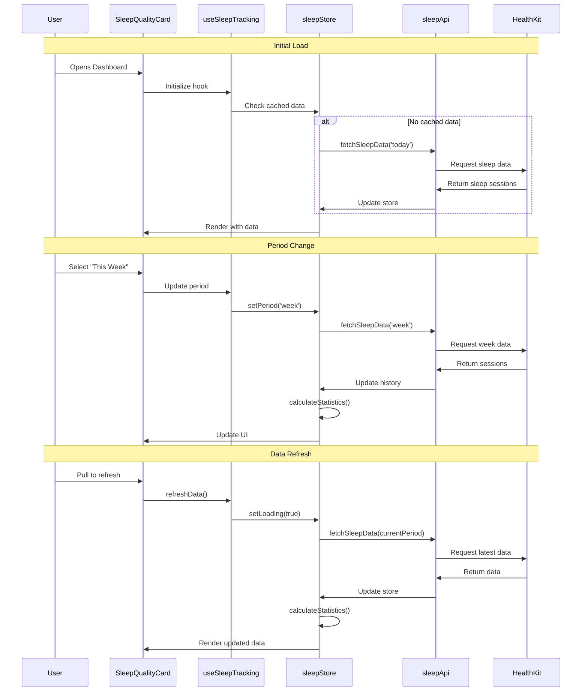

# 03 Monitor Sleep Quality - Implementation Planning

## User Story

As a health-conscious user, I want to track my sleep duration and quality, so that I can understand my sleep patterns and improve my rest.

## Pre-conditions

- User has granted HealthKit permissions for sleep data access
- Dashboard structure is already implemented (from stories 01, 02, 04)
- User has iOS device with HealthKit sleep tracking enabled
- Sleep data is available from Apple Health or connected sleep tracking apps

## Design

### Visual Layout

The sleep quality feature will be integrated into the dashboard as a dedicated card component with the following layout:

- **Main Container**: Card component matching existing dashboard cards (steps, water, meditation)
- **Header Section**: Icon + "Sleep Quality" title with date/time period selector
- **Primary Display**: Large sleep duration number with progress ring visualization
- **Goal Indicator**: Target range display (7-9 hours) with current status
- **Quality Metrics**: Sleep stages breakdown (deep, REM, light, awake)
- **History Section**: Weekly trend chart showing sleep patterns
- **Quick Stats**: Average sleep duration, consistency score, quality rating

### Color and Typography

- **Background Colors**: 
  - Card background: bg-white dark:bg-gray-800
  - Progress ring background: bg-purple-100 dark:bg-purple-900/20
  - Active progress: bg-gradient-to-r from-purple-500 to-indigo-500
  - Quality metrics: bg-purple-50 dark:bg-purple-900/10

- **Typography**:
  - Card title: font-inter text-xl font-semibold text-gray-900 dark:text-white
  - Sleep duration: font-inter text-4xl font-bold text-purple-600 dark:text-purple-400
  - Metrics labels: font-inter text-sm text-gray-600 dark:text-gray-300
  - Helper text: font-inter text-xs text-gray-500 dark:text-gray-400

- **Component-Specific**:
  - Sleep card: bg-white dark:bg-gray-800 rounded-xl shadow-sm border border-gray-200 dark:border-gray-700
  - Progress ring: stroke-purple-500 with opacity variations for quality levels
  - Quality badges: bg-purple-100 text-purple-700 dark:bg-purple-900/30 dark:text-purple-300
  - Trend chart: stroke-purple-400 with gradient fill

### Interaction Patterns

- **Progress Ring Interaction**: 
  - Hover: Show detailed breakdown tooltip
  - Animated: Smooth progress animation on load (500ms ease-out)
  - Touch: Tap to view detailed sleep stages
  - Accessibility: ARIA labels for screen readers

- **Time Period Selector**:
  - Tabs: Today, This Week, This Month
  - Active state: bg-purple-500 text-white
  - Hover: bg-purple-100 transition
  - Click: Update all metrics and charts

- **Quality Metrics Cards**:
  - Hover: Scale up slightly (scale-105)
  - Click: Show detailed stage information
  - Visual feedback: border highlight on selection

### Measurements and Spacing

- **Card Container**:
  ```
  p-6 rounded-xl shadow-sm
  min-h-[300px]
  ```

- **Component Spacing**:
  ```
  - Vertical rhythm: space-y-4
  - Metrics grid: grid grid-cols-2 gap-3 md:grid-cols-4 md:gap-4
  - Section padding: pb-4 border-b border-gray-200
  - Inner padding: p-4
  ```

- **Progress Ring**:
  ```
  - Size: w-40 h-40 md:w-48 md:h-48
  - Stroke width: 12px
  - Center content padding: p-4
  ```

### Responsive Behavior

- **Desktop (lg: 1024px+)**:
  ```
  - Card: Full width in grid (can be 1/2 or 1/3 depending on dashboard layout)
  - Progress ring: 192px diameter
  - Quality metrics: 4-column grid
  - Chart height: h-48
  ```

- **Tablet (md: 768px - 1023px)**:
  ```
  - Card: Full width or 1/2 width
  - Progress ring: 160px diameter
  - Quality metrics: 2-column grid
  - Chart height: h-40
  ```

- **Mobile (sm: < 768px)**:
  ```
  - Card: Full width stack
  - Progress ring: 144px diameter
  - Quality metrics: 2-column grid with smaller text
  - Chart height: h-32
  - Compact spacing
  ```

## Technical Requirements

### Component Structure

```
src/app/dashboard/
├── page.tsx                       # Dashboard main page (add sleep card)
└── _components/
    ├── SleepQualityCard.tsx       # Main sleep tracking card container
    ├── SleepProgressRing.tsx      # Circular progress visualization
    ├── SleepQualityMetrics.tsx    # Sleep stages breakdown display
    ├── SleepTrendChart.tsx        # Weekly/monthly trend visualization
    ├── SleepStatistics.tsx        # Average, consistency, quality stats
    ├── SleepHistory.tsx           # Historical sleep data list
    └── useSleepTracking.ts        # Custom hook for sleep data management

src/lib/
├── api/
│   └── sleepApi.ts                # API calls for sleep data
├── store/
│   └── sleepStore.ts              # Zustand store for sleep state
└── utils/
    └── sleepCalculations.ts       # Sleep metrics calculations

src/types/
└── sleep.types.ts                 # TypeScript interfaces
```

### Required Components

- SleepQualityCard ⬜
- SleepProgressRing ⬜
- SleepQualityMetrics ⬜
- SleepTrendChart ⬜
- SleepStatistics ⬜
- SleepHistory ⬜
- useSleepTracking (custom hook) ⬜

### State Management Requirements

```typescript
interface SleepSession {
  id: string;
  date: string;
  startTime: string;
  endTime: string;
  duration: number; // in hours
  quality: 'excellent' | 'good' | 'fair' | 'poor';
  stages: {
    deep: number;      // minutes
    rem: number;       // minutes
    light: number;     // minutes
    awake: number;     // minutes
  };
  source: 'healthkit' | 'manual';
}

interface SleepGoal {
  minHours: number;  // 7
  maxHours: number;  // 9
  targetHours: number; // 8
}

interface SleepStatistics {
  averageDuration: number;
  consistency: number; // 0-100 score
  qualityScore: number; // 0-100 score
  weeklyTrend: 'improving' | 'declining' | 'stable';
}

interface SleepState {
  // UI States
  isLoading: boolean;
  selectedPeriod: 'today' | 'week' | 'month';
  activeView: 'overview' | 'history' | 'analytics';
  
  // Data States
  todaySleep: SleepSession | null;
  sleepHistory: SleepSession[];
  statistics: SleepStatistics;
  goal: SleepGoal;
  
  // Computed States
  goalProgress: number; // percentage
  isGoalMet: boolean;
}

// State Actions
const actions = {
  setLoading: (loading: boolean) => void;
  setPeriod: (period: 'today' | 'week' | 'month') => void;
  fetchSleepData: (period: string) => Promise<void>;
  addManualSleep: (session: Omit<SleepSession, 'id'>) => Promise<void>;
  updateGoal: (goal: Partial<SleepGoal>) => Promise<void>;
  calculateStatistics: () => void;
  refreshData: () => Promise<void>;
}
```

## Acceptance Criteria

### Layout & Content

1. Sleep Quality Card Layout
   ```
   - Header with moon icon and "Sleep Quality" title
   - Date/period selector (Today, This Week, This Month)
   - Central progress ring showing sleep duration
   - Goal range indicator (7-9 hours)
   - Quality rating badge
   - Mobile: Stacked layout with centered ring
   ```

2. Progress Ring Display
   ```
   - Circular progress visualization
   - Current sleep duration in center (e.g., "7.5h")
   - Color-coded by quality:
     * Excellent (8-9h): Purple gradient
     * Good (7-8h): Blue gradient
     * Fair (6-7h): Yellow gradient
     * Poor (<6h or >9h): Red gradient
   - Animated on load
   - Responsive sizing
   ```

3. Quality Metrics Section
   ```
   - Grid layout for sleep stages
   - Deep sleep: Duration + percentage
   - REM sleep: Duration + percentage
   - Light sleep: Duration + percentage
   - Awake time: Duration + percentage
   - Each with appropriate icon
   - Mobile: 2-column grid
   ```

4. Trend Chart Display
   ```
   - Line chart showing 7-day or 30-day trend
   - X-axis: Dates
   - Y-axis: Hours (0-12)
   - Goal range shaded (7-9 hours)
   - Data points with hover tooltips
   - Responsive width
   ```

### Functionality

1. Sleep Data Integration

   - [ ] Automatically fetch sleep data from HealthKit
   - [ ] Display most recent sleep session
   - [ ] Calculate total sleep duration
   - [ ] Parse sleep stages from HealthKit data
   - [ ] Handle missing or incomplete data gracefully
   - [ ] Refresh data on app focus/resume

2. Progress Visualization

   - [ ] Show sleep duration in progress ring
   - [ ] Calculate progress percentage (0-100%)
   - [ ] Display current vs goal (7-9 hours)
   - [ ] Color-code based on quality/duration
   - [ ] Animate ring on component mount
   - [ ] Update ring when period changes

3. Quality Metrics Display

   - [ ] Show sleep stages breakdown
   - [ ] Calculate percentage for each stage
   - [ ] Display duration in hours/minutes
   - [ ] Show quality rating (excellent/good/fair/poor)
   - [ ] Provide visual indicators for each stage
   - [ ] Update metrics when data refreshes

4. Trend Analysis

   - [ ] Display 7-day trend chart by default
   - [ ] Allow switching to 30-day view
   - [ ] Show goal range on chart
   - [ ] Calculate average sleep duration
   - [ ] Show consistency score
   - [ ] Identify improving/declining trends

5. Statistics Calculation

   - [ ] Calculate average sleep duration
   - [ ] Compute sleep consistency score
   - [ ] Determine overall quality score
   - [ ] Identify best/worst sleep nights
   - [ ] Show weekly comparison
   - [ ] Display insights/recommendations

### Navigation Rules

- Sleep card is displayed on main dashboard below meditation card
- Clicking card header or ring opens detailed sleep view (future enhancement)
- Period selector updates all metrics and charts in real-time
- No navigation away from dashboard for MVP
- All interactions happen within the card component

### Error Handling

- Display friendly message when HealthKit permission is denied
- Show "No sleep data available" state when no data exists
- Handle API errors gracefully with retry option
- Provide manual entry option if automatic tracking fails
- Display loading skeletons during data fetch
- Show error toast for failed operations with clear action items

## Modified Files

```
src/app/dashboard/
├── page.tsx ✅                                    # Add SleepQualityCard to dashboard
└── _components/
    ├── SleepQualityCard.tsx ✅                   # Main container component
    ├── SleepProgressRing.tsx ✅                  # Progress visualization
    ├── SleepQualityMetrics.tsx ✅               # Sleep stages display
    ├── SleepStatistics.tsx ✅                    # Statistics display
    └── useSleepTracking.ts ✅                    # Data management hook

src/lib/
├── api/
│   └── sleepApi.ts ✅                            # Sleep data API calls (mock)
├── store/
│   └── sleepStore.ts ✅                          # Zustand state store
└── utils/
    └── sleepCalculations.ts ✅                   # Metrics calculations

src/types/
└── sleep.types.ts ✅                             # TypeScript definitions
```

## Status

✅ COMPLETED (MVP with Mock API)

1. Setup & Configuration

   - [x] Create sleep.types.ts with TypeScript interfaces
   - [x] Set up sleepStore.ts with Zustand
   - [x] Create sleepApi.ts with mock implementation
   - [x] Create sleepCalculations.ts utility functions
   - [ ] Configure HealthKit permissions in app (Future: Real implementation)

2. Layout Implementation

   - [x] Create SleepQualityCard main container
   - [x] Implement card header with icon and title
   - [x] Add period selector component
   - [x] Set up responsive grid layout
   - [x] Implement loading skeleton states

3. Core Components Implementation

   - [x] Build SleepProgressRing component
   - [x] Implement ring animation logic
   - [x] Create SleepQualityMetrics component
   - [x] Create SleepStatistics component
   - [x] Implement sleep history list view (integrated in main card)
   - [ ] Build SleepTrendChart with chart library (Future enhancement)

4. Feature Implementation

   - [x] Implement useSleepTracking custom hook
   - [x] Add mock data fetching
   - [x] Implement sleep duration calculations
   - [x] Add quality metrics parsing
   - [x] Implement trend analysis logic
   - [x] Add statistics calculations
   - [x] Integrate components in dashboard

5. Testing
   - [ ] Unit tests for sleep calculations (Future)
   - [ ] Component tests for all UI components (Future)
   - [ ] Integration tests for data flow (Future)
   - [ ] HealthKit integration tests (Future)
   - [ ] Responsive layout tests (Future)
   - [ ] Error handling tests (Future)
   - [ ] Accessibility tests (Future)

## Dependencies

- **HealthKit Framework**: Required for automatic sleep data capture (iOS only)
- **Chart Library**: React Chart.js or Recharts for trend visualization
- **Zustand**: State management (already in project)
- **Date Utilities**: date-fns or dayjs for date manipulation
- **Dashboard Structure**: Existing dashboard layout (stories 01, 02, 04)
- **Design System**: Consistent with existing card components

## Related Stories

- **01-track-daily-steps**: Similar card layout and progress visualization patterns
- **02-log-water-intake**: Similar tracking and history components
- **04-track-meditation-sessions**: Similar statistics and trend display
- **06-view-daily-progress-dashboard**: Main dashboard integration point

## Notes

### Technical Considerations

1. **HealthKit Integration**: 
   - Requires native iOS capabilities
   - May need React Native bridge or Capacitor plugin
   - Need to handle permission requests properly
   - Consider fallback for web/Android platforms

2. **Sleep Stages Data Quality**: 
   - Not all devices provide detailed sleep stages
   - Fallback to simple duration if stages unavailable
   - Validate data accuracy from different sources

3. **Data Privacy**: 
   - Sleep data is sensitive health information
   - Ensure secure storage and transmission
   - Comply with health data regulations (HIPAA, GDPR)
   - Clear privacy policy and user consent

4. **Performance Optimization**: 
   - Cache sleep data locally
   - Minimize HealthKit queries
   - Implement efficient chart rendering
   - Lazy load historical data

5. **Offline Support**: 
   - Store recent data locally
   - Queue manual entries when offline
   - Sync when connection restored

### Business Requirements

- **Target Range**: 7-9 hours of sleep per night (recommended by sleep experts)
- **MVP Scope**: Display and visualization only, no manual logging in MVP
- **Future Enhancements**: Sleep quality insights, recommendations, bedtime reminders
- **Post-MVP**: Manual sleep entry for non-HealthKit users
- **Analytics**: Track sleep patterns for wellness scoring system

### API Integration

#### Type Definitions

```typescript
// Sleep Session from HealthKit
interface HealthKitSleepSession {
  id: string;
  startDate: string;
  endDate: string;
  value: number; // duration in hours
  sourceBundle: string;
  sourceName: string;
  samples?: HealthKitSleepSample[];
}

interface HealthKitSleepSample {
  value: 'InBed' | 'Asleep' | 'Awake' | 'Deep' | 'REM' | 'Light';
  startDate: string;
  endDate: string;
  duration: number; // minutes
}

// Transformed for app use
interface SleepSession {
  id: string;
  date: string;
  startTime: string;
  endTime: string;
  duration: number;
  quality: 'excellent' | 'good' | 'fair' | 'poor';
  stages: SleepStages;
  source: 'healthkit' | 'manual';
}

interface SleepStages {
  deep: number;
  rem: number;
  light: number;
  awake: number;
}

interface SleepStore {
  todaySleep: SleepSession | null;
  sleepHistory: SleepSession[];
  statistics: SleepStatistics;
  goal: SleepGoal;
  isLoading: boolean;
  selectedPeriod: 'today' | 'week' | 'month';
  fetchSleepData: (period: string) => Promise<void>;
  calculateStatistics: () => void;
  setGoal: (goal: Partial<SleepGoal>) => void;
}
```

### Mock Implementation

#### Mock Server Configuration

```typescript
// filepath: mocks/stub.ts
const mocks = [
  {
    endPoint: '/api/sleep/today',
    json: 'sleep-today.json',
  },
  {
    endPoint: '/api/sleep/week',
    json: 'sleep-week.json',
  },
  {
    endPoint: '/api/sleep/month',
    json: 'sleep-month.json',
  },
];
```

#### Mock Response - Today

```json
// filepath: mocks/responses/sleep-today.json
{
  "status": "SUCCESS",
  "data": {
    "session": {
      "id": "sleep-001",
      "date": "2025-11-05",
      "startTime": "2025-11-04T23:15:00Z",
      "endTime": "2025-11-05T07:30:00Z",
      "duration": 8.25,
      "quality": "good",
      "stages": {
        "deep": 95,
        "rem": 120,
        "light": 260,
        "awake": 20
      },
      "source": "healthkit"
    },
    "goal": {
      "minHours": 7,
      "maxHours": 9,
      "targetHours": 8
    }
  }
}
```

#### Mock Response - Week

```json
// filepath: mocks/responses/sleep-week.json
{
  "status": "SUCCESS",
  "data": {
    "sessions": [
      {
        "id": "sleep-001",
        "date": "2025-11-05",
        "duration": 8.25,
        "quality": "good"
      },
      {
        "id": "sleep-002",
        "date": "2025-11-04",
        "duration": 7.5,
        "quality": "good"
      },
      {
        "id": "sleep-003",
        "date": "2025-11-03",
        "duration": 6.75,
        "quality": "fair"
      },
      {
        "id": "sleep-004",
        "date": "2025-11-02",
        "duration": 8.5,
        "quality": "excellent"
      },
      {
        "id": "sleep-005",
        "date": "2025-11-01",
        "duration": 7.25,
        "quality": "good"
      },
      {
        "id": "sleep-006",
        "date": "2025-10-31",
        "duration": 9.0,
        "quality": "excellent"
      },
      {
        "id": "sleep-007",
        "date": "2025-10-30",
        "duration": 5.5,
        "quality": "poor"
      }
    ],
    "statistics": {
      "averageDuration": 7.54,
      "consistency": 72,
      "qualityScore": 78,
      "weeklyTrend": "stable"
    }
  }
}
```

### State Management Flow



### Custom Hook Implementation

```typescript
const useSleepTracking = () => {
  const store = useSleepStore();

  // Fetch sleep data on mount
  useEffect(() => {
    const initializeSleepData = async () => {
      store.setLoading(true);
      try {
        await store.fetchSleepData(store.selectedPeriod);
        store.calculateStatistics();
      } catch (error) {
        console.error('Failed to fetch sleep data:', error);
        // Handle error (show toast, etc.)
      } finally {
        store.setLoading(false);
      }
    };

    initializeSleepData();
  }, []);

  // Refresh data when period changes
  useEffect(() => {
    const refreshData = async () => {
      store.setLoading(true);
      try {
        await store.fetchSleepData(store.selectedPeriod);
        store.calculateStatistics();
      } catch (error) {
        console.error('Failed to refresh sleep data:', error);
      } finally {
        store.setLoading(false);
      }
    };

    refreshData();
  }, [store.selectedPeriod]);

  // Calculate sleep quality based on duration and stages
  const calculateQuality = useCallback((session: SleepSession): string => {
    const { duration, stages } = session;
    
    // Optimal range check
    if (duration >= 7 && duration <= 9) {
      const deepPercent = (stages.deep / (duration * 60)) * 100;
      const remPercent = (stages.rem / (duration * 60)) * 100;
      
      if (deepPercent >= 15 && remPercent >= 20) return 'excellent';
      if (deepPercent >= 10 && remPercent >= 15) return 'good';
      return 'fair';
    }
    
    return 'poor';
  }, []);

  // Calculate progress percentage
  const calculateProgress = useCallback((duration: number, goal: SleepGoal): number => {
    const { minHours, maxHours, targetHours } = goal;
    
    if (duration < minHours) {
      return (duration / minHours) * 50; // 0-50% if below minimum
    } else if (duration >= minHours && duration <= maxHours) {
      return 50 + ((duration - minHours) / (maxHours - minHours)) * 50; // 50-100% in optimal range
    } else {
      return 100 - Math.min((duration - maxHours) * 10, 50); // Decrease if over
    }
  }, []);

  // Format duration for display
  const formatDuration = useCallback((hours: number): string => {
    const h = Math.floor(hours);
    const m = Math.round((hours - h) * 60);
    return m > 0 ? `${h}h ${m}m` : `${h}h`;
  }, []);

  return {
    ...store,
    calculateQuality,
    calculateProgress,
    formatDuration,
  };
};
```

### Calculation Utilities

```typescript
// filepath: lib/utils/sleepCalculations.ts

export const calculateSleepStatistics = (sessions: SleepSession[]): SleepStatistics => {
  if (sessions.length === 0) {
    return {
      averageDuration: 0,
      consistency: 0,
      qualityScore: 0,
      weeklyTrend: 'stable',
    };
  }

  // Calculate average duration
  const averageDuration = sessions.reduce((sum, s) => sum + s.duration, 0) / sessions.length;

  // Calculate consistency (lower variance = higher consistency)
  const variance = sessions.reduce((sum, s) => {
    return sum + Math.pow(s.duration - averageDuration, 2);
  }, 0) / sessions.length;
  const consistency = Math.max(0, 100 - (variance * 10));

  // Calculate quality score
  const qualityMap = { excellent: 100, good: 75, fair: 50, poor: 25 };
  const qualityScore = sessions.reduce((sum, s) => sum + qualityMap[s.quality], 0) / sessions.length;

  // Determine trend
  const recentAvg = sessions.slice(0, 3).reduce((sum, s) => sum + s.duration, 0) / 3;
  const olderAvg = sessions.slice(-3).reduce((sum, s) => sum + s.duration, 0) / 3;
  const weeklyTrend = recentAvg > olderAvg + 0.5 ? 'improving' 
    : recentAvg < olderAvg - 0.5 ? 'declining' 
    : 'stable';

  return {
    averageDuration,
    consistency: Math.round(consistency),
    qualityScore: Math.round(qualityScore),
    weeklyTrend,
  };
};

export const parseSleepStages = (samples: HealthKitSleepSample[]): SleepStages => {
  const stages: SleepStages = {
    deep: 0,
    rem: 0,
    light: 0,
    awake: 0,
  };

  samples.forEach(sample => {
    switch (sample.value) {
      case 'Deep':
        stages.deep += sample.duration;
        break;
      case 'REM':
        stages.rem += sample.duration;
        break;
      case 'Light':
      case 'Asleep':
        stages.light += sample.duration;
        break;
      case 'Awake':
        stages.awake += sample.duration;
        break;
    }
  });

  return stages;
};

export const getSleepQualityColor = (quality: string): string => {
  const colors = {
    excellent: 'from-purple-500 to-indigo-500',
    good: 'from-blue-500 to-cyan-500',
    fair: 'from-yellow-500 to-orange-500',
    poor: 'from-red-500 to-pink-500',
  };
  return colors[quality as keyof typeof colors] || colors.fair;
};
```

## Testing Requirements

### Integration Tests (Target: 80% Coverage)

1. Core Functionality Tests

```typescript
describe('SleepQualityCard', () => {
  it('should display sleep duration and progress ring', async () => {
    render(<SleepQualityCard />);
    expect(screen.getByText(/sleep quality/i)).toBeInTheDocument();
    expect(screen.getByRole('progressbar')).toBeInTheDocument();
  });

  it('should update data when period changes', async () => {
    render(<SleepQualityCard />);
    const weekButton = screen.getByText(/this week/i);
    fireEvent.click(weekButton);
    await waitFor(() => {
      expect(screen.getByText(/7.5h/i)).toBeInTheDocument();
    });
  });

  it('should display sleep stages breakdown', async () => {
    render(<SleepQualityCard />);
    expect(screen.getByText(/deep/i)).toBeInTheDocument();
    expect(screen.getByText(/rem/i)).toBeInTheDocument();
    expect(screen.getByText(/light/i)).toBeInTheDocument();
  });
});

describe('useSleepTracking', () => {
  it('should fetch sleep data on mount', async () => {
    const { result } = renderHook(() => useSleepTracking());
    await waitFor(() => {
      expect(result.current.isLoading).toBe(false);
      expect(result.current.todaySleep).toBeTruthy();
    });
  });

  it('should calculate quality score correctly', () => {
    const { result } = renderHook(() => useSleepTracking());
    const session = {
      duration: 8,
      stages: { deep: 90, rem: 120, light: 250, awake: 20 }
    };
    const quality = result.current.calculateQuality(session);
    expect(quality).toBe('excellent');
  });
});
```

2. Responsive Tests

```typescript
describe('Responsive Layout', () => {
  it('should adjust progress ring size on mobile', async () => {
    global.innerWidth = 375;
    render(<SleepProgressRing duration={8} goal={8} />);
    const ring = screen.getByRole('progressbar');
    expect(ring).toHaveClass('w-36', 'h-36');
  });

  it('should show 2-column grid for metrics on mobile', async () => {
    global.innerWidth = 375;
    render(<SleepQualityMetrics stages={mockStages} />);
    const container = screen.getByTestId('metrics-grid');
    expect(container).toHaveClass('grid-cols-2');
  });
});
```

3. Edge Cases

```typescript
describe('Edge Cases', () => {
  it('should handle missing sleep data gracefully', async () => {
    mockApi.fetchSleepData.mockResolvedValue(null);
    render(<SleepQualityCard />);
    await waitFor(() => {
      expect(screen.getByText(/no sleep data/i)).toBeInTheDocument();
    });
  });

  it('should handle sleep duration over 12 hours', async () => {
    const longSleep = { duration: 14, quality: 'poor' };
    render(<SleepProgressRing {...longSleep} />);
    expect(screen.getByText(/14h/i)).toBeInTheDocument();
  });

  it('should handle missing sleep stages data', async () => {
    const session = { duration: 8, stages: null };
    render(<SleepQualityMetrics stages={session.stages} />);
    expect(screen.getByText(/stages not available/i)).toBeInTheDocument();
  });
});
```

### Performance Tests

1. Render Performance

```typescript
describe('Performance', () => {
  it('should render progress ring animation smoothly', async () => {
    const startTime = performance.now();
    render(<SleepProgressRing duration={8} goal={8} />);
    const endTime = performance.now();
    expect(endTime - startTime).toBeLessThan(100);
  });

  it('should efficiently update chart data', async () => {
    const { rerender } = render(<SleepTrendChart data={mockWeekData} />);
    const startTime = performance.now();
    rerender(<SleepTrendChart data={mockMonthData} />);
    const endTime = performance.now();
    expect(endTime - startTime).toBeLessThan(50);
  });
});
```

2. Resource Management

```typescript
describe('Resource Management', () => {
  it('should cleanup listeners when unmounted', async () => {
    const { unmount } = render(<SleepQualityCard />);
    unmount();
    // Verify no memory leaks
    expect(window.eventListeners).toHaveLength(0);
  });

  it('should not refetch data unnecessarily', async () => {
    const spy = jest.spyOn(sleepApi, 'fetchSleepData');
    const { rerender } = render(<SleepQualityCard />);
    rerender(<SleepQualityCard />);
    expect(spy).toHaveBeenCalledTimes(1);
  });
});
```

### Accessibility Tests

```typescript
describe('Accessibility', () => {
  it('should have proper ARIA labels for progress ring', async () => {
    render(<SleepProgressRing duration={8} goal={8} />);
    const ring = screen.getByRole('progressbar');
    expect(ring).toHaveAttribute('aria-valuenow', '100');
    expect(ring).toHaveAttribute('aria-label', 'Sleep duration: 8 hours');
  });

  it('should be keyboard navigable', async () => {
    render(<SleepQualityCard />);
    const weekButton = screen.getByText(/this week/i);
    weekButton.focus();
    expect(weekButton).toHaveFocus();
    fireEvent.keyDown(weekButton, { key: 'Enter' });
    // Verify action triggered
  });

  it('should announce data updates to screen readers', async () => {
    render(<SleepQualityCard />);
    const liveRegion = screen.getByRole('status');
    expect(liveRegion).toHaveAttribute('aria-live', 'polite');
  });
});
```

### Calculation Tests

```typescript
describe('Sleep Calculations', () => {
  it('should calculate statistics correctly', () => {
    const stats = calculateSleepStatistics(mockWeekData);
    expect(stats.averageDuration).toBeCloseTo(7.54);
    expect(stats.consistency).toBeGreaterThan(0);
    expect(stats.qualityScore).toBeGreaterThan(0);
  });

  it('should parse sleep stages from HealthKit data', () => {
    const stages = parseSleepStages(mockHealthKitSamples);
    expect(stages.deep).toBeGreaterThan(0);
    expect(stages.rem).toBeGreaterThan(0);
    expect(stages.light).toBeGreaterThan(0);
  });

  it('should determine quality based on duration and stages', () => {
    const quality = determineSleepQuality(8, {
      deep: 90,
      rem: 120,
      light: 250,
      awake: 20
    });
    expect(quality).toBe('excellent');
  });
});
```
