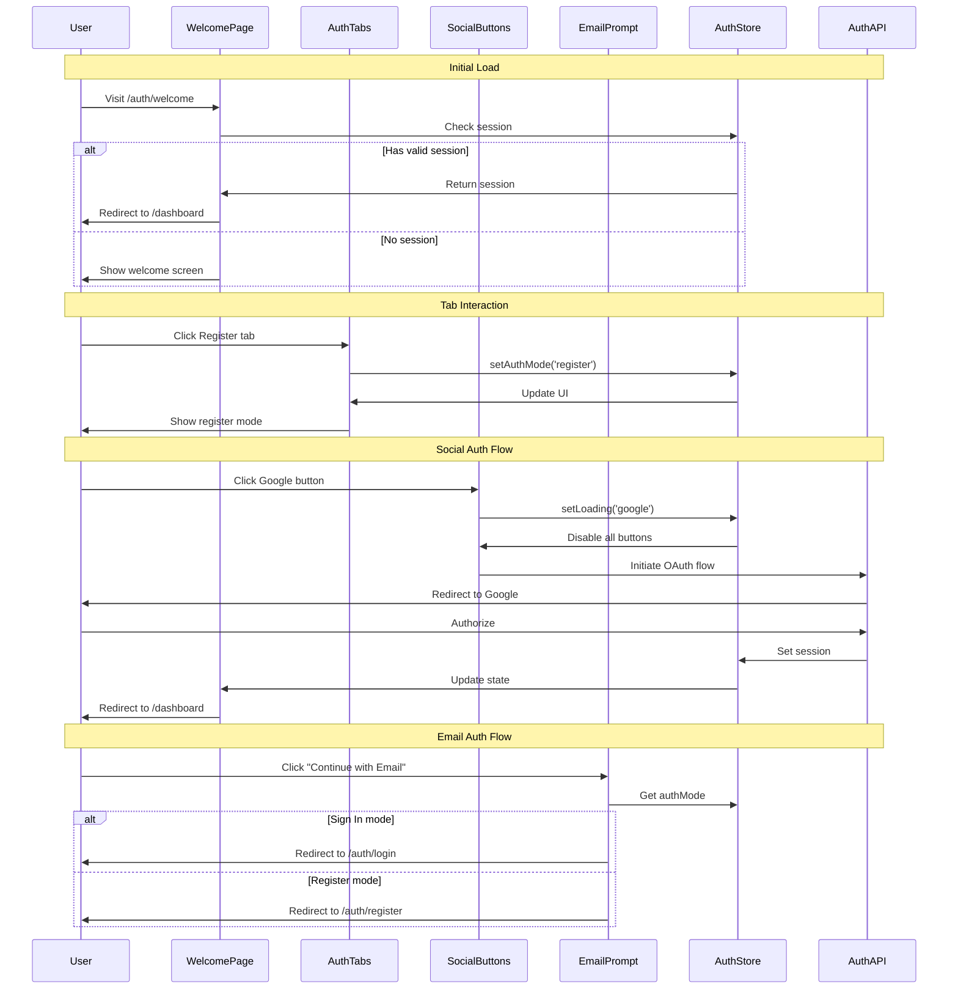

# 18 - Choose Authentication Method - Implementation Planning

## User Story

As a new or returning user, I want to see a clear welcome screen with options to sign in or register via email or social media, so that I can choose my preferred authentication method and quickly access the app.

## Pre-conditions

- None - This is the entry point for unauthenticated users
- App is installed and launched for the first time or user is logged out
- No existing session token is present

## Design

### Visual Layout

The authentication welcome screen follows a clean, modern design with:
- **Hero Section**: App logo and tagline at the top ("Your wellness companion in one app")
- **Authentication Options**: Centered card with clear separation between sign-in and register flows
- **Social Buttons**: Prominent social authentication buttons (Google, Apple, Facebook)
- **Email Option**: Traditional email/password authentication as an alternative
- **Footer Links**: Terms of service, privacy policy, and help links

### Color and Typography

- **Background Colors**: 
  - Primary: bg-gradient-to-b from-blue-50 to-white dark:from-gray-900 dark:to-gray-800
  - Card: bg-white dark:bg-gray-800 shadow-xl
  - Accent: bg-blue-600 hover:bg-blue-700

- **Typography**:
  - Hero Heading: font-sans text-4xl md:text-5xl font-bold text-gray-900 dark:text-white
  - Tagline: font-sans text-lg text-gray-600 dark:text-gray-300
  - Button Text: font-sans text-base font-medium text-white
  - Links: text-blue-600 hover:text-blue-700 dark:text-blue-400

- **Component-Specific**:
  - Social Buttons: bg-white dark:bg-gray-700 border border-gray-300 dark:border-gray-600 hover:bg-gray-50 dark:hover:bg-gray-600
  - Primary Button: bg-blue-600 text-white hover:bg-blue-700 shadow-md
  - Divider: border-t border-gray-200 dark:border-gray-700

### Interaction Patterns

- **Button Interaction**: 
  - Hover: Background transition (200ms ease), slight scale (1.02)
  - Click: Scale down to 0.98, ripple effect
  - Loading: Show spinner, disable all interactions, opacity 0.7
  - Accessibility: Focus ring-2 ring-blue-500, keyboard navigation

- **Tab/Mode Switching**:
  - Active tab: Bold text, border-b-2 border-blue-600
  - Inactive tab: Normal text, hover:text-gray-900
  - Transition: 150ms ease for smooth switching
  - Accessibility: Arrow key navigation, ARIA labels

### Measurements and Spacing

- **Container**:
  ```
  min-h-screen flex items-center justify-center px-4 sm:px-6 lg:px-8
  ```

- **Component Spacing**:
  ```
  - Hero section: mb-8 md:mb-12
  - Card padding: p-8 md:p-10
  - Button spacing: space-y-3
  - Divider margins: my-6
  - Footer: mt-8 pt-4
  ```

### Responsive Behavior

- **Desktop (lg: 1024px+)**:
  ```
  - Card: max-w-md w-full
  - Logo: h-16 w-16
  - Text: text-4xl for hero
  - Two-column layout for additional info (optional)
  ```

- **Tablet (md: 768px - 1023px)**:
  ```
  - Card: max-w-sm w-full
  - Logo: h-12 w-12
  - Text: text-3xl for hero
  - Single column layout
  ```

- **Mobile (sm: < 768px)**:
  ```
  - Full-width card with minimal padding
  - Logo: h-10 w-10
  - Text: text-2xl for hero
  - Stack all elements vertically
  - Reduced spacing
  ```

## Technical Requirements

### Component Structure

```
src/app/auth/
├── page.tsx                           # Main auth landing page (redirects to welcome)
├── welcome/
│   ├── page.tsx                       # Welcome screen with auth options
│   └── _components/
│       ├── AuthCard.tsx               # Main authentication card container
│       ├── AuthTabs.tsx               # Tab switcher between Sign In/Register
│       ├── SocialAuthButtons.tsx      # Social media auth buttons
│       ├── EmailAuthPrompt.tsx        # Email auth option
│       └── AuthFooter.tsx             # Terms, privacy, help links
├── login/
│   └── page.tsx                       # Email sign-in page (Story 15)
├── register/
│   └── page.tsx                       # Email registration page (Story 14)
└── _components/
    └── AuthLayout.tsx                 # Shared layout for all auth pages
```

### Required Components

- AuthCard ⬜
- AuthTabs ⬜
- SocialAuthButtons ⬜
- EmailAuthPrompt ⬜
- AuthFooter ⬜
- AuthLayout ⬜

### State Management Requirements

```typescript
// lib/store/authStore.ts
interface AuthState {
  // UI States
  authMode: 'signin' | 'register';
  isLoading: boolean;
  loadingProvider: 'google' | 'apple' | 'facebook' | 'email' | null;
  
  // User States
  user: User | null;
  session: Session | null;
  
  // Error States
  error: string | null;
  
  // Actions
  setAuthMode: (mode: 'signin' | 'register') => void;
  setLoading: (provider: string | null) => void;
  setUser: (user: User | null) => void;
  setSession: (session: Session | null) => void;
  setError: (error: string | null) => void;
  clearError: () => void;
  logout: () => void;
}

// Types
interface User {
  id: string;
  email: string;
  name?: string;
  avatar?: string;
  provider: 'email' | 'google' | 'apple' | 'facebook';
}

interface Session {
  token: string;
  expiresAt: Date;
  refreshToken?: string;
}
```

## Acceptance Criteria

### Layout & Content

1. Welcome Screen Layout
   ```
   - App logo centered at top (h-16 on desktop, h-12 on tablet, h-10 on mobile)
   - Tagline "Your wellness companion in one app" below logo
   - Authentication card centered on screen
   - Tab switcher at top of card (Sign In | Register)
   - Social buttons below tabs
   - "Or" divider with horizontal lines
   - Email authentication prompt
   - Footer with legal links at bottom
   ```

2. Card Structure
   ```
   - White background with shadow on light mode
   - Dark gray background with border on dark mode
   - Rounded corners (rounded-lg)
   - Responsive padding (p-8 on desktop, p-6 on mobile)
   - Maximum width constraint (max-w-md)
   ```

3. Branding Elements
   ```
   - Consistent color scheme (blue primary)
   - Clear hierarchy (logo → tagline → actions)
   - Welcoming tone in copy
   - Professional appearance
   ```

### Functionality

1. Tab Navigation

   - [ ] Sign In tab displays by default
   - [ ] Clicking Register tab switches to register mode
   - [ ] Active tab is visually highlighted
   - [ ] Tab state persists during user interaction
   - [ ] Keyboard navigation (arrow keys) works

2. Social Authentication Options

   - [ ] Google sign-in button is displayed with icon
   - [ ] Apple sign-in button is displayed with icon
   - [ ] Facebook sign-in button is displayed with icon
   - [ ] Clicking any social button shows loading state
   - [ ] All other buttons are disabled during loading
   - [ ] Loading indicator shows which provider is active

3. Email Authentication Option
   - [ ] "Continue with Email" button is displayed
   - [ ] Clicking redirects to appropriate page based on mode
   - [ ] Sign In mode → /auth/login
   - [ ] Register mode → /auth/register
   - [ ] Button has distinct styling from social buttons

### Navigation Rules

- Unauthenticated users accessing protected routes are redirected to /auth/welcome
- Users with valid sessions accessing /auth/welcome are redirected to /dashboard
- Clicking social provider initiates OAuth flow (handled by auth provider)
- Email option redirects to email-specific auth pages
- Back button from login/register returns to welcome screen

### Error Handling

- Network errors show toast notification: "Connection failed. Please check your internet."
- Provider errors show specific message: "Unable to sign in with [Provider]. Please try again."
- Session errors redirect to welcome screen with message

## Modified Files

```
src/app/auth/
├── page.tsx ⬜                        # Auth landing/redirect
├── welcome/
│   ├── page.tsx ⬜                    # Main welcome screen
│   └── _components/
│       ├── AuthCard.tsx ⬜
│       ├── AuthTabs.tsx ⬜
│       ├── SocialAuthButtons.tsx ⬜
│       ├── EmailAuthPrompt.tsx ⬜
│       └── AuthFooter.tsx ⬜
└── _components/
    └── AuthLayout.tsx ⬜
    
lib/
├── store/
│   └── authStore.ts ⬜
└── types/
    └── auth.types.ts ⬜
```

## Status

🟨 IN PROGRESS

1. Setup & Configuration

   - [ ] Install authentication dependencies (if needed: next-auth, etc.)
   - [ ] Create auth directory structure
   - [ ] Set up auth type definitions
   - [ ] Create auth store with Zustand

2. Layout Implementation

   - [ ] Create AuthLayout component with gradient background
   - [ ] Implement responsive container
   - [ ] Add hero section with logo and tagline
   - [ ] Create AuthCard with proper styling

3. Component Implementation

   - [ ] Build AuthTabs component with mode switching
   - [ ] Implement SocialAuthButtons with three providers
   - [ ] Create EmailAuthPrompt component
   - [ ] Build AuthFooter with legal links
   - [ ] Add loading states and transitions

4. Navigation & Routing

   - [ ] Set up welcome page route
   - [ ] Implement auth mode state management
   - [ ] Configure redirects for authenticated users
   - [ ] Set up navigation to email auth pages

5. Testing
   - [ ] Tab switching functionality
   - [ ] Responsive layout on all breakpoints
   - [ ] Keyboard navigation and accessibility
   - [ ] Loading states for each provider
   - [ ] Navigation flow between auth screens

## Dependencies

- Authentication provider (NextAuth.js, Supabase Auth, or custom solution)
- Social OAuth providers configuration (Google, Apple, Facebook)
- Session management system
- Protected route middleware

## Related Stories

- [Story 14] - Register with Email (email registration flow)
- [Story 15] - Sign In with Email (email login flow)
- [Story 16] - Register with Social Media (OAuth registration)
- [Story 17] - Sign In with Social Media (OAuth sign-in)

## Notes

### Technical Considerations

1. **Authentication Provider Selection**: Need to choose between NextAuth.js (Auth.js), Supabase Auth, Firebase Auth, or custom solution. NextAuth.js recommended for flexibility.

2. **OAuth Configuration**: Each social provider requires:
   - Developer account and app setup
   - Client ID and secret
   - Redirect URI configuration
   - Scope permissions

3. **Session Management**: Implement JWT tokens with refresh mechanism for secure, scalable authentication.

4. **Security**: 
   - HTTPS required for production
   - CSRF protection
   - Secure cookie settings
   - Rate limiting for auth endpoints

5. **Performance**: Lazy load social provider SDKs to reduce initial bundle size.

### Business Requirements

- First impression is critical - design must be clean and inviting
- Target audience (millennials/Gen Z) expects social sign-in options
- Reduced friction in onboarding increases conversion rates
- Clear value proposition ("Your wellness companion in one app")

### API Integration

#### Type Definitions

```typescript
// types/auth.types.ts

interface User {
  id: string;
  email: string;
  name?: string;
  avatar?: string;
  provider: AuthProvider;
  createdAt: Date;
  lastLoginAt: Date;
}

interface Session {
  token: string;
  expiresAt: Date;
  refreshToken?: string;
  user: User;
}

type AuthProvider = 'email' | 'google' | 'apple' | 'facebook';

type AuthMode = 'signin' | 'register';

interface AuthError {
  code: string;
  message: string;
  provider?: AuthProvider;
}

interface AuthState {
  authMode: AuthMode;
  isLoading: boolean;
  loadingProvider: AuthProvider | null;
  user: User | null;
  session: Session | null;
  error: AuthError | null;
}
```

### OAuth Providers Configuration

```typescript
// lib/auth/providers.ts

export const authProviders = {
  google: {
    id: 'google',
    name: 'Google',
    icon: 'GoogleIcon',
    authorizationUrl: 'https://accounts.google.com/o/oauth2/v2/auth',
    scope: 'openid email profile',
  },
  apple: {
    id: 'apple',
    name: 'Apple',
    icon: 'AppleIcon',
    authorizationUrl: 'https://appleid.apple.com/auth/authorize',
    scope: 'name email',
  },
  facebook: {
    id: 'facebook',
    name: 'Facebook',
    icon: 'FacebookIcon',
    authorizationUrl: 'https://www.facebook.com/v12.0/dialog/oauth',
    scope: 'public_profile email',
  },
};
```

### State Management Implementation

```typescript
// lib/store/authStore.ts
import { create } from 'zustand';
import { persist } from 'zustand/middleware';

interface AuthStore extends AuthState {
  setAuthMode: (mode: AuthMode) => void;
  setLoading: (provider: AuthProvider | null) => void;
  setUser: (user: User | null) => void;
  setSession: (session: Session | null) => void;
  setError: (error: AuthError | null) => void;
  clearError: () => void;
  logout: () => void;
}

export const useAuthStore = create<AuthStore>()(
  persist(
    (set) => ({
      authMode: 'signin',
      isLoading: false,
      loadingProvider: null,
      user: null,
      session: null,
      error: null,

      setAuthMode: (mode) => set({ authMode: mode, error: null }),
      
      setLoading: (provider) => set({ 
        isLoading: !!provider, 
        loadingProvider: provider 
      }),
      
      setUser: (user) => set({ user }),
      
      setSession: (session) => set({ session }),
      
      setError: (error) => set({ 
        error, 
        isLoading: false, 
        loadingProvider: null 
      }),
      
      clearError: () => set({ error: null }),
      
      logout: () => set({ 
        user: null, 
        session: null, 
        error: null 
      }),
    }),
    {
      name: 'auth-storage',
      partialize: (state) => ({ 
        session: state.session,
        user: state.user 
      }),
    }
  )
);
```

### Component State Flow



### Custom Hooks

```typescript
// app/auth/welcome/_components/useAuthRedirect.ts
import { useEffect } from 'react';
import { useRouter } from 'next/navigation';
import { useAuthStore } from '@/lib/store/authStore';

export const useAuthRedirect = () => {
  const router = useRouter();
  const { session, user } = useAuthStore();

  useEffect(() => {
    if (session && user) {
      router.push('/dashboard');
    }
  }, [session, user, router]);
};

// app/auth/welcome/_components/useSocialAuth.ts
import { useCallback } from 'react';
import { useAuthStore } from '@/lib/store/authStore';
import type { AuthProvider } from '@/types/auth.types';

export const useSocialAuth = () => {
  const { setLoading, setError } = useAuthStore();

  const handleSocialAuth = useCallback(async (provider: AuthProvider) => {
    try {
      setLoading(provider);
      
      // Initiate OAuth flow
      // This will redirect the user to the provider's authorization page
      window.location.href = `/api/auth/signin/${provider}`;
      
    } catch (error) {
      setError({
        code: 'AUTH_FAILED',
        message: `Unable to sign in with ${provider}. Please try again.`,
        provider,
      });
      setLoading(null);
    }
  }, [setLoading, setError]);

  return { handleSocialAuth };
};
```

## Testing Requirements

### Integration Tests (Target: 80% Coverage)

1. Core Functionality Tests

```typescript
// tests/e2e/auth-welcome.spec.ts
import { test, expect } from '@playwright/test';

describe('Authentication Welcome Screen', () => {
  test('should display welcome screen with all auth options', async ({ page }) => {
    await page.goto('/auth/welcome');
    
    // Check hero elements
    await expect(page.getByRole('heading', { name: /healthify/i })).toBeVisible();
    await expect(page.getByText(/your wellness companion/i)).toBeVisible();
    
    // Check auth tabs
    await expect(page.getByRole('tab', { name: /sign in/i })).toBeVisible();
    await expect(page.getByRole('tab', { name: /register/i })).toBeVisible();
    
    // Check social buttons
    await expect(page.getByRole('button', { name: /continue with google/i })).toBeVisible();
    await expect(page.getByRole('button', { name: /continue with apple/i })).toBeVisible();
    await expect(page.getByRole('button', { name: /continue with facebook/i })).toBeVisible();
    
    // Check email option
    await expect(page.getByRole('button', { name: /continue with email/i })).toBeVisible();
    
    // Check footer links
    await expect(page.getByRole('link', { name: /terms of service/i })).toBeVisible();
    await expect(page.getByRole('link', { name: /privacy policy/i })).toBeVisible();
  });

  test('should switch between sign in and register modes', async ({ page }) => {
    await page.goto('/auth/welcome');
    
    // Check default is sign in
    const signInTab = page.getByRole('tab', { name: /sign in/i });
    await expect(signInTab).toHaveAttribute('aria-selected', 'true');
    
    // Switch to register
    const registerTab = page.getByRole('tab', { name: /register/i });
    await registerTab.click();
    await expect(registerTab).toHaveAttribute('aria-selected', 'true');
    await expect(signInTab).toHaveAttribute('aria-selected', 'false');
  });

  test('should show loading state when social auth is clicked', async ({ page }) => {
    await page.goto('/auth/welcome');
    
    const googleButton = page.getByRole('button', { name: /continue with google/i });
    await googleButton.click();
    
    // Check loading state
    await expect(page.getByTestId('loading-spinner')).toBeVisible();
    
    // Check other buttons are disabled
    await expect(page.getByRole('button', { name: /continue with apple/i })).toBeDisabled();
    await expect(page.getByRole('button', { name: /continue with facebook/i })).toBeDisabled();
  });
});
```

2. Navigation Tests

```typescript
describe('Authentication Navigation', () => {
  test('should redirect to login page in sign in mode', async ({ page }) => {
    await page.goto('/auth/welcome');
    
    // Ensure sign in mode is active
    const signInTab = page.getByRole('tab', { name: /sign in/i });
    await signInTab.click();
    
    // Click email button
    const emailButton = page.getByRole('button', { name: /continue with email/i });
    await emailButton.click();
    
    // Check redirect
    await expect(page).toHaveURL('/auth/login');
  });

  test('should redirect to register page in register mode', async ({ page }) => {
    await page.goto('/auth/welcome');
    
    // Switch to register mode
    const registerTab = page.getByRole('tab', { name: /register/i });
    await registerTab.click();
    
    // Click email button
    const emailButton = page.getByRole('button', { name: /continue with email/i });
    await emailButton.click();
    
    // Check redirect
    await expect(page).toHaveURL('/auth/register');
  });

  test('should redirect authenticated users to dashboard', async ({ page }) => {
    // Set up authenticated session
    await page.goto('/auth/login');
    // ... perform login
    
    // Try to access welcome page
    await page.goto('/auth/welcome');
    
    // Should redirect to dashboard
    await expect(page).toHaveURL('/dashboard');
  });
});
```

3. Responsive Tests

```typescript
describe('Responsive Behavior', () => {
  test('should display correctly on mobile devices', async ({ page }) => {
    await page.setViewportSize({ width: 375, height: 667 });
    await page.goto('/auth/welcome');
    
    // Check layout adjustments
    const card = page.locator('[data-testid="auth-card"]');
    await expect(card).toBeVisible();
    
    // Check button stacking
    const buttons = page.locator('button[data-auth-button]');
    const buttonsCount = await buttons.count();
    expect(buttonsCount).toBeGreaterThan(0);
  });

  test('should display correctly on tablet devices', async ({ page }) => {
    await page.setViewportSize({ width: 768, height: 1024 });
    await page.goto('/auth/welcome');
    
    const card = page.locator('[data-testid="auth-card"]');
    await expect(card).toBeVisible();
  });

  test('should display correctly on desktop', async ({ page }) => {
    await page.setViewportSize({ width: 1920, height: 1080 });
    await page.goto('/auth/welcome');
    
    const card = page.locator('[data-testid="auth-card"]');
    await expect(card).toBeVisible();
  });
});
```

4. Accessibility Tests

```typescript
describe('Accessibility', () => {
  test('should have proper ARIA labels and roles', async ({ page }) => {
    await page.goto('/auth/welcome');
    
    // Check tabs have proper ARIA attributes
    const signInTab = page.getByRole('tab', { name: /sign in/i });
    await expect(signInTab).toHaveAttribute('aria-selected');
    
    // Check buttons are keyboard accessible
    await page.keyboard.press('Tab');
    const focusedElement = await page.evaluate(() => document.activeElement?.tagName);
    expect(focusedElement).toBeTruthy();
  });

  test('should support keyboard navigation', async ({ page }) => {
    await page.goto('/auth/welcome');
    
    // Navigate through tabs with arrow keys
    const signInTab = page.getByRole('tab', { name: /sign in/i });
    await signInTab.focus();
    await page.keyboard.press('ArrowRight');
    
    const registerTab = page.getByRole('tab', { name: /register/i });
    await expect(registerTab).toBeFocused();
  });

  test('should have sufficient color contrast', async ({ page }) => {
    await page.goto('/auth/welcome');
    
    // This would need axe-core or similar for actual testing
    // Placeholder for accessibility testing
    const buttons = page.locator('button');
    await expect(buttons.first()).toBeVisible();
  });
});
```

### Performance Tests

```typescript
describe('Performance', () => {
  test('should load quickly on initial visit', async ({ page }) => {
    const startTime = Date.now();
    await page.goto('/auth/welcome');
    const loadTime = Date.now() - startTime;
    
    expect(loadTime).toBeLessThan(3000); // Should load within 3 seconds
  });

  test('should handle rapid tab switching', async ({ page }) => {
    await page.goto('/auth/welcome');
    
    const signInTab = page.getByRole('tab', { name: /sign in/i });
    const registerTab = page.getByRole('tab', { name: /register/i });
    
    // Rapidly switch tabs
    for (let i = 0; i < 10; i++) {
      await registerTab.click();
      await signInTab.click();
    }
    
    // Should still be functional
    await expect(signInTab).toHaveAttribute('aria-selected', 'true');
  });
});
```

### Test Environment Setup

```typescript
// tests/e2e/fixtures/auth.fixture.ts
import { test as base } from '@playwright/test';

export const test = base.extend({
  authenticatedPage: async ({ page }, use) => {
    // Set up authenticated session
    await page.goto('/auth/login');
    await page.fill('[name="email"]', 'test@example.com');
    await page.fill('[name="password"]', 'password123');
    await page.click('button[type="submit"]');
    await page.waitForURL('/dashboard');
    
    await use(page);
  },
});
```
